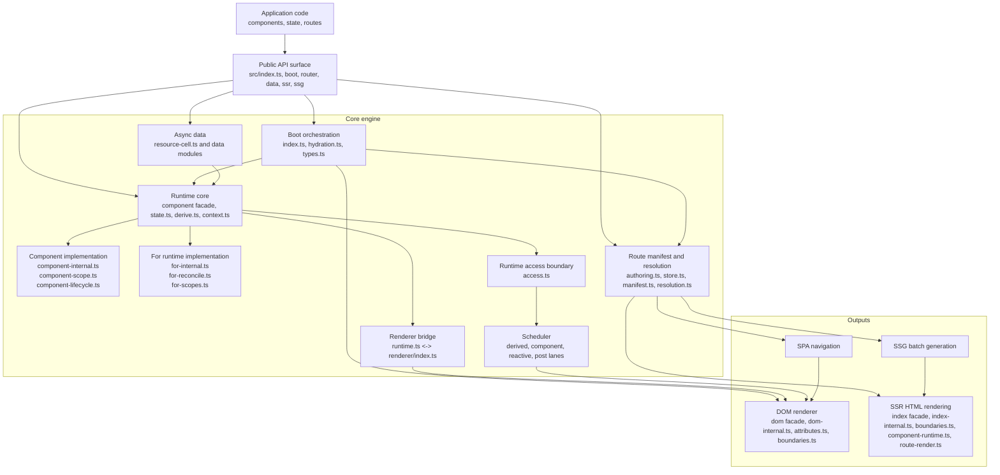

# Internals: Core Engine Design

This page documents the current `askr` core engine shape from the source tree.
It is intended as a design map for contributors, not as API-first user docs.

The diagrams below reflect the current boundaries in `src/boot`, `src/runtime`,
`src/renderer`, `src/router`, `src/ssr`, `src/ssg`, and `src/data`.

## 1. Big picture

This first diagram is the system view: how application code flows into the
reactive runtime, then out through routing, DOM rendering, and server-side
rendering pipelines.

## 2. Module map

This is the static ownership view: which source areas own which responsibilities.

```mermaid
flowchart TB
  app[Application code]
  api[src/index.ts public API]

  subgraph core[Core reactive runtime]
    state[state.ts]
    derive[derive.ts]
    context[context.ts]
    componentFacade[component.ts facade]
    componentCore[component-internal.ts]
    componentScope[component-scope.ts]
    componentCommit[component-commit.ts]
    componentLifecycle[component-lifecycle.ts]
    forFacade[for.ts facade]
    forCore[for-internal.ts]
    forReconcile[for-reconcile.ts]
    forScopes[for-scopes.ts]
    forSignals[for-signals.ts]
    readable[readable subscriptions]
    scheduler[scheduler.ts]
    runtime[runtime.ts]
    access[runtime/access.ts]
  end

  subgraph bootArea[Boot]
    bootIndex[boot/index.ts lifecycle facade]
    bootHydration[hydration.ts selective hydration]
    bootTypes[types.ts boot config contracts]
  end

  subgraph render[DOM renderer]
    bridge[renderer/index.ts bridge]
    evaluate[evaluate.ts]
    domFacade[dom.ts facade]
    domCore[dom-internal.ts]
    attrs[attributes.ts]
    boundaries[boundaries.ts]
    reconcile[reconcile.ts and keyed.ts]
    keyedChildren[keyed-children.ts]
    namespaces[namespaces.ts]
    forCommit[for-commit.ts]
    cleanup[cleanup.ts]
  end

  subgraph route[Routing]
    routeFacade[route.ts facade]
    authoring[authoring.ts declarations]
    routeStore[store.ts state]
    routeManifest[manifest.ts registry and manifest]
    routeResolution[resolution.ts matching and requests]
    routeActivity[activity.ts current route]
    match[match.ts path ranking and params]
    nav[navigate.ts navigation orchestration]
    navScroll[navigation-scroll.ts scroll restoration]
  end

  subgraph dataLayer[Async data]
    resource[resource-cell.ts]
    query[data/index.ts query and mutation runtime]
    dataTypes[types.ts public and internal contracts]
    queryKey[query-key.ts scoped key serialization]
    dataShared[shared.ts readable and error helpers]
  end

  subgraph server[Server outputs]
    ssrFacade[ssr/index.ts facade]
    ssrCore[index-internal.ts]
    ssrBoundaries[boundaries.ts]
    ssrComponents[component-runtime.ts]
    ssrRoute[route-render.ts]
    ssrHelpers[attrs, escape, sink, render-resolved]
    ssg[ssg/create-static-gen.ts]
  end

  app --> api
  api --> bootIndex
  bootIndex --> bootTypes
  bootIndex --> bootHydration
  bootIndex --> runtime
  bootIndex --> routeFacade
  bootIndex --> nav
  bootHydration --> dom
  api --> state
  api --> derive
  api --> context
  api --> runtime
  runtime --> access
  access --> scheduler
  state --> readable
  derive --> readable
  componentFacade --> componentCore
  componentFacade --> componentScope
  componentCore --> componentScope
  componentCore --> componentLifecycle
  componentCore --> readable
  componentCore --> access
  forFacade --> forCore
  forCore --> componentFacade
  forCore --> forReconcile
  forReconcile --> forScopes
  forScopes --> componentFacade
  forScopes --> forSignals
  forCore --> readable
  api --> bridge
  bridge --> runtime
  bridge --> evaluate
  evaluate --> domFacade
  evaluate --> reconcile
  evaluate --> componentFacade
  domFacade --> domCore
  domCore --> attrs
  domCore --> boundaries
  domCore --> forCommit
  reconcile --> keyedChildren
  reconcile --> namespaces
  reconcile --> cleanup
  api --> routeFacade
  routeFacade --> authoring
  routeFacade --> routeManifest
  routeFacade --> routeResolution
  routeFacade --> routeActivity
  authoring --> routeStore
  authoring --> match
  routeManifest --> routeStore
  routeResolution --> routeStore
  routeResolution --> match
  routeActivity --> routeResolution
  nav --> routeFacade
  nav --> navScroll
  api --> resource
  api --> query
  query --> dataTypes
  query --> queryKey
  query --> dataShared
  routeResolution --> ssrFacade
  routeManifest --> ssg
  ssrFacade --> ssrCore
  ssrCore --> ssrBoundaries
  ssrCore --> ssrComponents
  ssrCore --> ssrRoute
  ssrCore --> ssrHelpers
  componentFacade --> ssrComponents
  ssg --> ssrFacade
```

## 3. Drill-down pages

Use the dedicated internals pages below for the more detailed subsystem
diagrams:

- [Runtime reactivity](./runtime-reactivity.md)
- [Renderer pipeline](./renderer-pipeline.md)
- [SSR and SSG pipeline](./ssr-ssg-pipeline.md)
- [Router internals](./router-manifest.md)

## Design notes

- `src/runtime/runtime.ts` is intentionally small. It owns the scheduler and a
  pluggable renderer host instead of embedding DOM behavior directly.
- `src/runtime/component.ts`, `src/runtime/for.ts`, `src/renderer/dom.ts`, and
  `src/ssr/index.ts` are compatibility facades. Their current implementations
  live in `component-internal.ts` plus `component-scope.ts`,
  `component-commit.ts`, and `component-lifecycle.ts`,
  `for-internal.ts` plus `for-reconcile.ts`, `for-scopes.ts`, and
  `for-signals.ts`, `dom-internal.ts`, and the SSR `index-internal.ts` plus
  `boundaries.ts`, `component-runtime.ts`, and `route-render.ts`.
- `src/runtime/access.ts` is the internal boundary used by runtime, renderer,
  data, and FX implementation paths when they need the default scheduler or
  renderer host. Compatibility globals remain exported from their original
  modules.
- `src/renderer/index.ts` installs the renderer bridge at package startup, which
  lets runtime primitives stay renderer-agnostic.
- `src/renderer/attributes.ts` and `src/renderer/boundaries.ts` are active DOM
  renderer owners wired through `dom-internal.ts`.
- `src/boot/index.ts` is the public lifecycle facade. `boot/types.ts` owns boot
  config contracts and `boot/hydration.ts` owns selective hydration DOM helpers.
- `src/router/route.ts` is a facade. `authoring.ts`, `store.ts`,
  `manifest.ts`, `activity.ts`, and `resolution.ts` own the router
  responsibilities that used to live together, while `match.ts` handles
  ranking, segment parsing, and param extraction.
- `src/router/navigate.ts` owns browser navigation orchestration, while
  `navigation-scroll.ts` owns scroll restoration state and history scroll
  persistence.
- `src/data/index.ts` owns the shared query and mutation runtime. `types.ts`
  owns the public and internal data contracts, `query-key.ts` owns scoped key
  serialization, and `shared.ts` owns readable notification and async error
  helpers used by data cells.
- `src/ssr/index.ts` is the stable SSR facade. `index-internal.ts` owns
  synchronous serialization, `boundaries.ts` owns error/control boundary state
  helpers and fallback construction, `component-runtime.ts` owns synchronous
  component execution and temporary owner cleanup, and `route-render.ts` owns
  route/document orchestration for object-form rendering and streams.
- `src/ssg/create-static-gen.ts` is an orchestration layer over route expansion,
  SSR rendering, file output, and metadata generation rather than a separate
  rendering engine.

## Architecture Review Notes

The diagrams above expose follow-up issues that are not fully solved by the
facade cleanup:

- The largest DOM and component responsibilities are still grouped in explicit
  internal `.ts` implementation clusters. Architecture checks reject `.mts`
  source files and track the current cluster line counts, while the SSR
  serialization cluster now stays under the oversized-file limit with boundary,
  component, and route responsibilities split out.
- SSG depends on SSR, not the other way around. Diagrams should keep that edge
  direction explicit because it is the contract that preserves one server
  renderer.
- The renderer helper owners (`attributes.ts` and `boundaries.ts`) are now
  active dependencies. Future extraction should keep the running path wired to
  the owner modules rather than duplicating behavior.
- `For` state/hook ownership, reconciliation strategy, child-scope lifecycle,
  and item/index/property signal behavior are now split across
  `runtime/for-internal.ts`, `runtime/for-reconcile.ts`,
  `runtime/for-scopes.ts`, and `runtime/for-signals.ts`.

## Related docs

- [Core: Runtime](../core/runtime.md)
- [Core: Rendering](../core/rendering.md)
- [Core: Routing](../core/routing.md)
- [Core: Data](../core/data.md)
- [Runtime reactivity](./runtime-reactivity.md)
- [Renderer pipeline](./renderer-pipeline.md)
- [SSR and SSG pipeline](./ssr-ssg-pipeline.md)
- [Router internals](./router-manifest.md)
