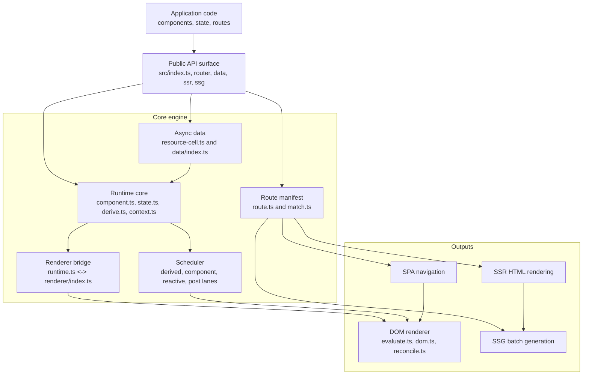
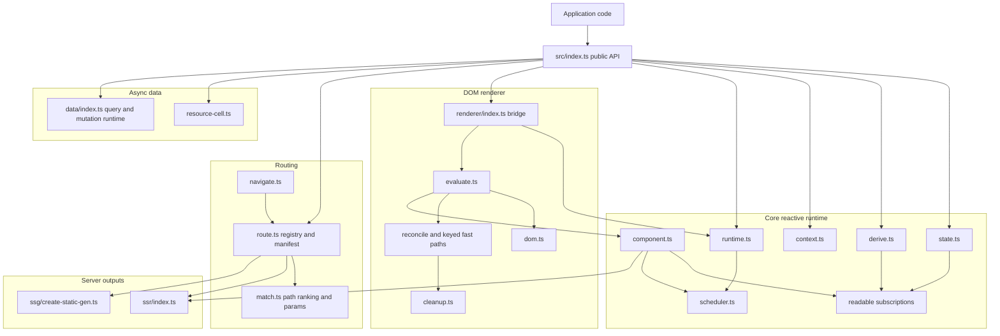

# Internals: Core Engine Design

This page documents the current `askr` core engine shape from the source tree.
It is intended as a design map for contributors, not as API-first user docs.

The diagrams below reflect the current boundaries in `src/runtime`, `src/renderer`,
`src/router`, `src/ssr`, `src/ssg`, and `src/data`.

## 1. Big picture

This first diagram is the system view: how application code flows into the
reactive runtime, then out through routing, DOM rendering, and server-side
rendering pipelines.

## 2. Module map

This is the static ownership view: which source areas own which responsibilities.

## 3. Drill-down pages

Use the dedicated internals pages below for the more detailed subsystem
diagrams:

- [Runtime reactivity](./runtime-reactivity.md)
- [Renderer pipeline](./renderer-pipeline.md)
- [SSR and SSG pipeline](./ssr-ssg-pipeline.md)
- [Router internals](./router-manifest.md)

## Design notes

- `src/runtime/runtime.ts` is intentionally small. It owns the scheduler and a
  pluggable renderer host instead of embedding DOM behavior directly.
- `src/renderer/index.ts` installs the renderer bridge at package startup, which
  lets runtime primitives stay renderer-agnostic.
- `src/router/route.ts` builds one normalized manifest, while `src/router/match.ts`
  handles ranking, segment parsing, and param extraction.
- `src/ssr/index.ts` reuses the same component and route model, but swaps the
  sink from DOM mutation to synchronous HTML serialization.
- `src/ssg/create-static-gen.ts` is an orchestration layer over route expansion,
  SSR rendering, file output, and metadata generation rather than a separate
  rendering engine.

## Related docs

- [Core: Runtime](../core/runtime.md)
- [Core: Rendering](../core/rendering.md)
- [Core: Routing](../core/routing.md)
- [Core: Data](../core/data.md)
- [Runtime reactivity](./runtime-reactivity.md)
- [Renderer pipeline](./renderer-pipeline.md)
- [SSR and SSG pipeline](./ssr-ssg-pipeline.md)
- [Router internals](./router-manifest.md)
