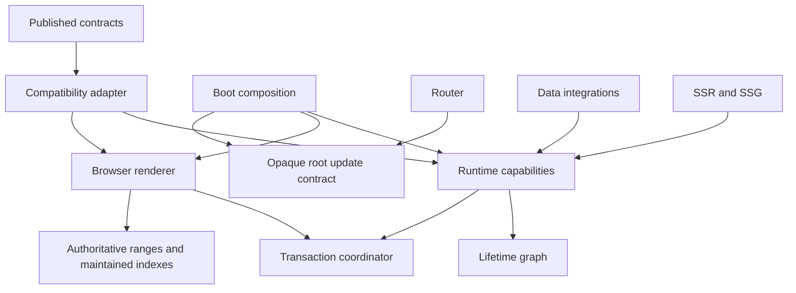

# Internals: Core Engine Design

The core separates lifetime ownership, execution, transactions, and host state.
Published application and renderer extension contracts are maintained by the
compatibility adapter; internal modules depend on capabilities and leaf contracts.

The [runtime source layout](../development/runtime-layout.md) and
[renderer source layout](../development/renderer-layout.md) map these owners
to their implementation directories.

| Responsibility                                         | Authoritative owner            |
| ------------------------------------------------------ | ------------------------------ |
| Lifetimes, child disposal, cancellation, subscriptions | Runtime ownership records      |
| Synchronous execution, hooks, reactive reads           | Runtime execution layer        |
| Preparation, application, publication, settlement      | Shared transaction coordinator |
| DOM ranges, indexes, listeners, refs, restoration      | Browser renderer               |
| Matching, loading, policies, navigation decisions      | Router                         |
| Root generation updates and host wiring                | Boot                           |
| Query caches and request generations                   | Data runtime                   |
| Request context, output, streaming, static generation  | SSR and SSG                    |

## Lifetime and execution

Each component generation has one runtime-owned lifetime. Ordinary components,
control branches, keyed items, and portal children attach to that graph.
Resources, watches, and data subscriptions attach cleanup to their owning
lifetime. Disposal invalidates first and drains descendants iteratively before
parent cleanup, subscription removal, cancellation, and finalization. Strict
failures aggregate after the drain; ordinary development warnings remain.

Execution records retain hook state and render revisions. Lifetime identity,
render revision, and async request revision invalidate different work and remain
distinct. Retained components can change parents without changing their lifetime.
Root generation preparation, rollback, and retirement belong to the runtime.
Navigation no longer discovers lifetimes through DOM traversal.

## Rendering and commits

The renderer owns one range representation and central updates to owner/range
and node/owner indexes, including shared wrapper chains. The runtime performs
no browser inspection or mutation. Boot installs renderer capabilities;
recursive renderer calls use an explicitly composed internal host.

Scheduled, inline, control, keyed, optimized, and hydration rendering use the
same transaction lifecycle:

1. Prepare execution, owners, subscriptions, and rollback state.
2. Apply reversible framework-owned host changes.
3. Publish prepared ownership and subscriptions.
4. Drain retirement and lifecycle work, then complete integrations.

Nested rendering joins its enclosing transaction. Before publication, failure
restores framework state and disposes provisional owners. After publication,
settlement drains failures through existing boundaries without undoing user
side effects. Fast paths optimize host application and defer notifications
through the same coordinator; they do not own another commit protocol.

## Integrations and compatibility

Boot composes opaque root updates from runtime generation preparation and a
renderer host snapshot. Router decisions publish only with successful root
updates; multi-root rollback, retained layouts, history, metadata, and scroll
share the transaction. Lifecycle-triggered navigation cannot let an older
transaction overwrite a newer destination.

Data keeps its existing shared cache and request cancellation semantics. SSR
has explicit request context and detached temporary component lifetimes.
Synchronous execution scopes restore through `finally`, including nested SSR.
Default runtime selection and intentional browser history sharing remain public
behavior.

The compatibility adapter preserves `AskrRuntime`, renderer host signatures,
observable extension properties, and exported subpaths. Its component views
reference authoritative internal state. Scoped-child collections are maintained
indexes translated into the same lifetime graph when extensions mutate them.
Internal modules never depend on compatibility shapes.

Native boot installs renderer capabilities directly. Public runtime views track
that installation lazily, so applications do not load the extension translator
merely to mount a root. Published boot also installs the lifetime property views
needed by readable owner maps. Both paths use the same execution records.

## Enforcement

Architecture tests follow imports and re-exports, distinguish type-only edges,
and reject implementation-level value-import cycles touching runtime or renderer.
Observable tests cover ownership, rollback, reentrancy, cleanup failures,
hydration, navigation, cancellation, and deep chains. Frozen consumer examples,
normalized reachable declarations, and packed consumer fixtures protect the
published boundary. Module size and source-string matching are not substitutes
for those contracts.

See [ownership](../development/ownership.md),
[commit protocol](../development/commit-protocol.md),
[renderer ownership](../development/renderer-ownership.md),
[integrations](../development/integration-boundaries.md), and
[quality contracts](../development/quality-contracts.md).
