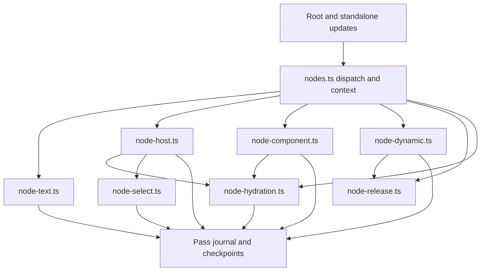

# DOM node implementation ownership

`src/core/dom/nodes.ts` dispatches child descriptors and supplies the shared
`RenderContext`. Implementations record work on that context's `Pass`. The pass
owns commit, reversible undo, discard, and cleanup ordering. Node modules use
the same journal and checkpoints throughout creation, patching, activation,
replacement, and release.

| Private module      | Responsibility                                                                                                                  |
| ------------------- | ------------------------------------------------------------------------------------------------------------------------------- |
| `node-text.ts`      | Text adoption and reversible updates, including value-less option synchronization.                                              |
| `node-host.ts`      | Host creation, prop/child patching and adopted-host attribute retirement.                                                       |
| `node-component.ts` | Component execution, inherited context revisions, transparent self-component chains and error-boundary checkpoints.             |
| `node-dynamic.ts`   | Function-child reads, injected standalone update scheduling and hook-order replacement.                                         |
| `node-hydration.ts` | Dormant host registration/activation, current hydration render state, resource slot claims and deferred portal output adoption. |
| `node-release.ts`   | Iterative child-first lifetime release and dormant-host retirement after detachment.                                            |
| `node-select.ts`    | Option-triggered controlled-select settlement and per-pass deduplication.                                                       |
| `node-context.ts`   | Element/child namespaces and nearest component ownership.                                                                       |

Hydration receives the existing node dispatch contract through the context or
an argument. Deferred component hydration receives the component render callback
from its owner module. This keeps hydration below dispatch and standalone update
orchestration while retaining one renderer. Architecture checks forbid node
implementations from importing `nodes.ts`, `root.ts`, or `updates.ts` at runtime
and retain the acyclic core dependency requirement.

The hydration render guard includes resource-slot claims as well as component
execution. A failed claim restores the preceding render context before an error
propagates; a regression injects that failure and verifies a retry adopts the
same server node.

A dormant host's marker and registry entry change in a reversible commit
operation. Child claims are discarded on render failure; commit failure
restores the prior DOM, renderer state and marker for retry. Deferred portal
output claims retain their cursor and held nodes until adoption commits. The
component module continues to own boundary rewind and ancestor-context revision
publication. Controlled selects settle after option mutations once per pass;
boundary rewind drops only the schedules it created.

Qualification includes render/commit rollback, deferred portal rollback, dormant
and idle activation retry, hydration child-sync rollback, controlled selects,
renderer bindings and lifecycle suites, browser hydration, and measured
positional-text/deferred-hydration workloads. Public entrypoints retain their
existing contracts.
