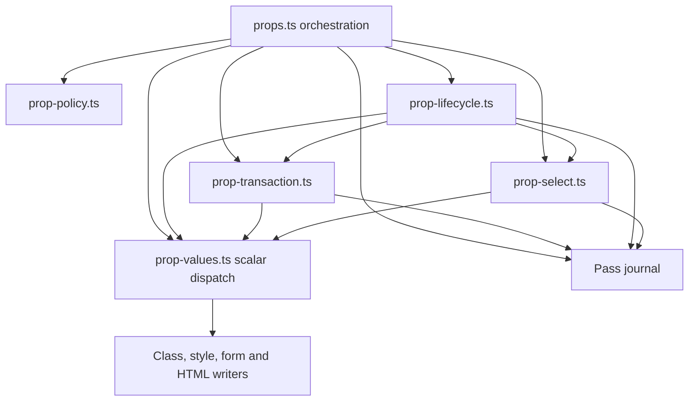

# Host prop implementation ownership

`props.ts` coordinates initial writes, child-trailing select values and prop
diffs. `prop-values.ts` dispatches scalar values to the private DOM writers.
Their existing internal entrypoints remain available to node implementations;
the package's public entrypoints are unchanged.

| Private module        | Responsibility                                                                                         |
| --------------------- | ------------------------------------------------------------------------------------------------------ |
| `prop-policy.ts`      | Classify bindings, simple attributes, input/boolean controls and child-trailing values.                |
| `prop-lifecycle.ts`   | Install, replace and retire reactive bindings, event handlers and refs.                                |
| `prop-transaction.ts` | Capture live attributes/properties/children and enqueue reversible scalar writes on the owning `Pass`. |
| `prop-select.ts`      | Capture exact option selection and resynchronize controlled selects after option changes.              |
| `prop-value-class.ts` | Preserve externally installed classes while changing owned tokens.                                     |
| `prop-value-style.ts` | Normalize style values and change only owned properties.                                               |
| `prop-value-form.ts`  | Synchronize live input, checkbox, option and select state with reflected attributes.                   |
| `prop-value-html.ts`  | Apply explicit HTML ownership while preserving already matching descendants.                           |

Fresh detached elements retain their direct initial writes. Adopted and committed
elements use the same pass operations and undo records as before extraction.
Form snapshots retain live values as well as attributes; select snapshots retain
option identities, selected flags and the prior selected index. Controlled values
still follow children, and option-triggered resynchronization retains its existing
node/pass settlement order.

The lifecycle module owns the binding map, last-applied binding values, event
installation and cleanup, and ref callbacks. Provisional binding installation and
retirement register reversible commit work; successful settlement retires the old
computation. Ref callbacks run after commit settlement. A failed reversible write
therefore leaves the committed ref attached and skips replacement callbacks; a
throwing callback after settlement reports the error while retaining the committed
DOM and attempting both old cleanup and new attachment.

Value writers neither own a pass nor install lifetimes. Architecture assertions
forbid their runtime dependencies on those layers and prevent lower prop modules
from importing node or prop orchestration. The existing acyclic dependency check
continues to apply.

Characterization includes bindings, retained/foreign attributes, property escapes,
class/style and dangerous HTML, forms, hydration rollback and ref errors. The
combined lifetime regression starts from both fresh and adopted hosts, fails a
later host write after preparing listener/binding/ref replacement, verifies the
old listener and binding still work, retries with the same element, and checks
that successful replacement and final release each clean up exactly once. A
separate failed initial adoption verifies provisional listeners and bindings are
discarded, no ref attaches, and a retry installs each lifetime once on the same
server element.
