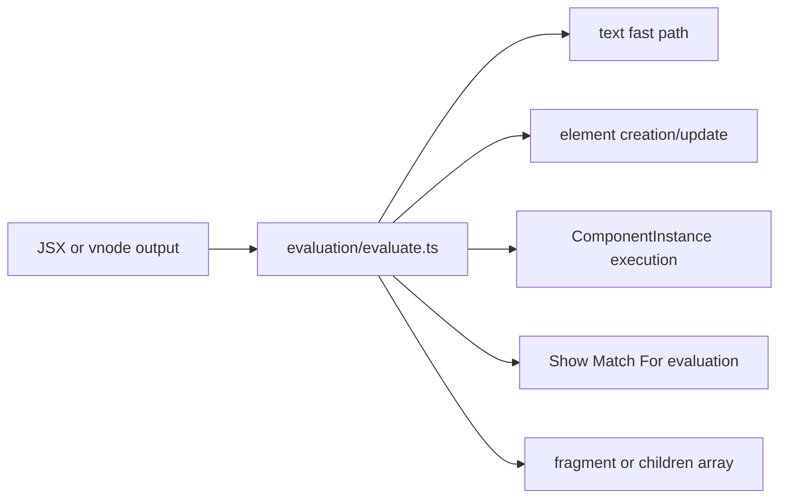
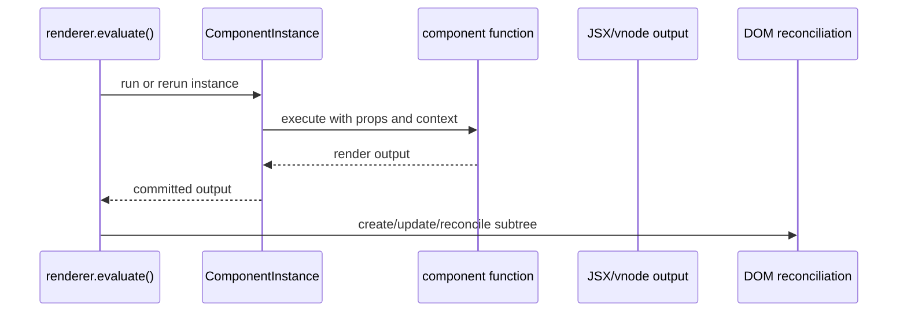
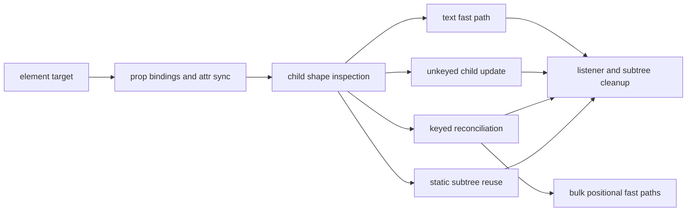

# Internals: Renderer Pipeline

This page documents the DOM-side rendering pipeline in `src/renderer` and the
bridge it uses into the runtime.

The [renderer source layout](../development/renderer-layout.md) maps the pipeline
stages to their implementation directories.

## Renderer bridge

The runtime does not hardcode DOM behavior. `src/boot/runtime-wiring.ts` installs
the capabilities created by `src/renderer/index.ts` through `src/runtime/access.ts`.
`src/runtime/runtime-state.ts` owns the renderer wiring.

```mermaid
flowchart LR
  publicApi[src/index.ts]
  bridge[installRendererBridge()]
  runtime[runtime-state.ts]
  host[RendererCapabilities]
  renderer[renderer evaluate and cleanup methods]

  publicApi --> bridge
  bridge --> runtime
  runtime --> host
  host --> renderer
```

## Evaluation pipeline

`evaluate()` is the central dispatcher. It decides whether a node is text,
element, component, fragment, or control-flow boundary, then routes it to the
right DOM or component path.



## DOM Implementation Ownership

The public renderer entrypoint is intentionally tiny. `dom-internal.ts` now
coordinates element creation and host registration while active helper modules
own component hosts, child reconciliation, stable patching, error-boundary DOM,
reactive children, attributes, and control-boundary commits.

```mermaid
flowchart TB
  facade[dom.ts facade]
  internal[dom-internal.ts orchestration]
  domHost[dom-host.ts host contract]
  componentHost[component/host.ts component host orchestration]
  componentCreation[component/host-creation.ts host creation]
  componentNested[component/host-nested-results.ts nested result resolution]
  componentResults[component/host-results.ts result materialization and owner publication]
  componentInstances[component/host-instances.ts component instance metadata]
  componentCleanup[component/host-cleanup.ts detached host cleanup]
  elementChildren[children/element-children.ts element child updates]
  childrenFastpath[children/children-fastpath.ts positional keyed fast path]
  stablePatch[reconciliation/stable-patch.ts stable intrinsic patching]
  errorBoundaryDom[component/error-boundary.ts error fallback DOM]
  reactiveChildren[children/reactive-children.ts reactive child effects]
  reactiveChildDom[children/reactive-child-dom.ts reactive child DOM sync]
  reactiveSources[children/reactive-child-sources.ts reactive child planning]
  childShape[children/child-shape.ts child normalization]
  propBindings[props/bindings.ts listeners and reactive props]
  attributes[props/attributes.ts scalar props and keys]
  intrinsic[intrinsic element create orchestration]
  boundaries[control/boundaries.ts control and For boundary commit]
  boundaryPlacement[control/range-placement.ts mixed-parent placement]
  boundaryCleanup[control/range-cleanup.ts range teardown]
  boundarySync[control/range-sync.ts scope range synchronization]
  staticReuse[static subtree and child-slot reuse]
  reconcile[reconciliation/reconcile.ts keyed orchestration]
  reconcileFast[reconciliation/reconcile-fastpaths.ts fast paths]
  reconcileResolution[reconciliation/reconcile-resolution.ts vnode resolution]
  reconcileCommit[reconciliation/reconcile-commit.ts DOM commit]
  forCommit[for/commit.ts For list DOM commit]
  forRanges[for/ranges.ts exact range commit]
  forMap[for/dom-map.ts DOM key maps]
  forRemoval[for/removal.ts removed node teardown]
  forReorder[for/reorder.ts move-only reorder]
  cleanup[ownership/cleanup.ts teardown]

  facade --> internal
  internal --> domHost
  internal --> componentHost
  componentHost --> componentCreation
  componentHost --> componentNested
  componentHost --> componentResults
  componentHost --> componentInstances
  internal --> componentCleanup
  internal --> elementChildren
  internal --> childrenFastpath
  internal --> stablePatch
  internal --> errorBoundaryDom
  internal --> reactiveChildren
  reactiveChildren --> reactiveChildDom
  reactiveChildren --> reactiveSources
  internal --> childShape
  internal --> propBindings
  internal --> attributes
  internal --> intrinsic
  internal --> boundaries
  boundaries --> boundaryPlacement
  boundaries --> boundaryCleanup
  boundaries --> boundarySync
  internal --> staticReuse
  internal --> reconcile
  reconcile --> reconcileFast
  reconcile --> reconcileResolution
  reconcile --> reconcileCommit
  internal --> forCommit
  forCommit --> forRanges
  forCommit --> forMap
  forCommit --> forRemoval
  forCommit --> forReorder
  internal --> cleanup
```



## Component to DOM handoff

Components do not mutate DOM directly. They produce render output, then hand
that result back to the renderer.



## DOM reconciliation

The renderer has multiple commit strategies depending on node shape. Keyed
lists and bulk text updates take specialized paths.

The keyed `For` strategies share one transaction boundary. Evaluation may
prepare destination nodes off the live tree, but retained-node mutations,
keyed maps, component hosts, listeners, refs, portals, readable subscriptions,
resources, and child-scope ownership are provisional until the outer commit
succeeds. A failure discards lifecycle work and restores the previous DOM plus
renderer metadata. Bulk replacement and clear paths may publish with one DOM
operation only when their exact-boundary checks prove that no unrelated node
can be claimed or removed.



## Control-flow boundaries

Control primitives are normalized before DOM commit. The runtime computes their
active branch or list state, and the renderer commits the resulting children.


## Anchored DOM ranges

`src/common/dom-range.ts` and `src/renderer/ownership/ranges.ts` provide the single
internal range abstraction used by `ChildScope`, `Show`, `Case`, fragments, and
`For`. A one-node result keeps the existing singleton fast path. A result with
multiple nodes is anchored by deterministic comments:

```html
<!--askr-range-start-->
...owned output...
<!--askr-range-end-->
```

The anchors are structural ownership boundaries, not user-visible wrappers.
Range operations move, replace, remove, iterate, and restore the complete
owned output, so a keyed `For` reorder cannot separate siblings or claim the
next positional child. Empty ranges retain their anchors for later hydration
and updates. Client hydration validates the marker structure before adopting
nodes, and SSR emits the same markers deterministically.

## Renderer transactions

Every rendering strategy joins the runtime's shared transaction coordinator.
Preparation captures execution, ownership, and subscriptions; reversible
application changes renderer-owned DOM, ranges, refs, listeners, bindings, and
portals. Publication makes the prepared framework state authoritative before
settlement drains departed owners and lifecycle work. Nested rendering joins its
enclosing transaction and cannot publish independently. A pre-publication failure
restores framework-owned state and disposes provisional owners. A settlement
failure drains remaining work without undoing arbitrary user side effects.

The original render error remains the thrown error. Rollback failures are
aggregated and reported afterward. Cleanup of an outgoing committed owner is
also deferred until replacement succeeds, and is performed exactly once.
Nested component reuse requires vnode owner, parent position, key, and wrapper
depth; type alone is not an identity contract.

Initial hydration has one additional guarded path. A complete preflight may
adopt a matching, unkeyed intrinsic subtree without running general-purpose
reconciliation. The adoption walk publishes only refs and listeners, with one
bindings-only retained record per changed element. Existing bindings,
components, reactive props, keys, or any structural/value mismatch reject the
fast path before mutation.

Deferred hydration uses boundary-local records rather than root-wide reruns.
Activation removes one skip marker, stages lifecycle and listener publication,
and commits the boundary only after its update succeeds. Rollback restores the
marker and discards provisional listeners, refs, bindings, and ownership so a
later reveal can retry safely.

Cold intrinsic creation uses an owner- and document-scoped blueprint after the
first validated result. Subsequent rows clone the retained element shape,
prepare reactive bindings and delegated listeners off the live tree, then
publish them only after the complete shape check succeeds. Direct intrinsic
children use a bounded recursive shortcut; fragments and other flattened child
forms retain the general validator. First bindings on fresh elements publish
through the fresh-element cleanup path, while later bindings on the same
element join the existing retained record.

Retained-element snapshot preparation shares the update's transaction failure
boundary. Preparation failures invoke the same error callback as update
failures. An owned transaction is discarded and its current scope released
even when that callback throws; an enclosing transaction remains the caller's
responsibility. The error callback runs before rollback so it can retire
provisional work, but cannot prevent rollback by throwing.

Fine-grained effects keep the first two readable sources inline and widen to a
collection only for the third distinct source. `For` item property reads use
the same first/two/3+ representation, preserving precise invalidation while
avoiding per-row collection allocation in the common case. Singleton ranges
also use a direct range constructor, but still register ownership metadata.

## Cleanup model

Cleanup is a first-class concern because listener ownership and component-owned
subtrees need precise teardown.

Removed-owner disposal is a post-publication phase of a successful transaction.
Errors from that disposal and from newly activated lifecycle work are collected
and reported after the coherent commit; they do not trigger a partial rollback
after outgoing ownership has already been finalized.

```mermaid
flowchart LR
  subtree[DOM subtree]
  listeners[elementListeners]
  instances[component instances under node]
  teardown[teardownNodeSubtree()]
  cleanup[cleanupInstancesUnder()]

  subtree --> teardown
  subtree --> cleanup
  teardown --> listeners
  cleanup --> instances
```

## Design notes

- `src/renderer/evaluation/evaluate.ts` is the renderer's dispatcher.
- `src/renderer/dom.ts` is the compatibility facade for the DOM renderer.
  `src/renderer/dom-internal.ts` coordinates active element creation,
  host registration, and helper-owner orchestration.
- `src/renderer/dom-host.ts` owns the internal host contract used by renderer
  helpers that need DOM operations without importing the facade.
- `src/renderer/component/host.ts` orchestrates component host reuse and
  synchronization. `component/host-creation.ts` owns initial host creation.
- `src/renderer/component/host-replacement.ts` owns component-host replacement
  transactions, provisional ownership rollback, and retained-host cleanup.
- `src/renderer/component/host-nested-results.ts` owns nested component and
  wrapper result resolution, while `component/host-results.ts` owns result
  materialization and owner-chain publication.
- `src/renderer/component/host-instances.ts` owns route-root detection,
  cleanup-strict inheritance, vnode component instance storage, component
  instance IDs, component host instance lookup, and component key inheritance.
- `src/renderer/component/host-cleanup.ts` owns detached component host cleanup
  and stale host instance pruning.
- `src/renderer/children/element-children.ts` owns element child updates, keyed child
  map lookup, empty-child handling, scalar replacement, and unkeyed children.
- `src/renderer/hydration/adoption.ts` owns the hydration-scoped,
  preflighted adoption path for matching intrinsic SSR subtrees.
- `src/renderer/children/children-fastpath.ts` owns positional keyed bulk text updates,
  tag reuse checks, and keyed DOM map refreshes used by reconciliation and DOM
  evaluation.
- `src/renderer/component/error-boundary.ts` owns DOM creation for error-boundary
  fallback and child rendering.
- `src/renderer/reconciliation/stable-patch.ts` owns stable intrinsic patching and dirty
  `For` item patch attempts.
- `src/renderer/props/attributes.ts` owns scalar prop writes and removals, including
  class token patching, style string/object/null handling, form `value` and
  `checked`, stale attribute removal, static scalar props, and key
  materialization.
  Retained scalar attributes and nonempty classes are compared with the live DOM
  before writing, so equal values avoid redundant mutations and external changes
  are still repaired. Empty class handling retains HTML/SVG differences. Stale
  attribute cleanup snapshots the original attribute objects before removal
  callbacks can change the collection.
- `src/renderer/props/bindings.ts` orchestrates initial prop application and
  update-time prop/listener diffing in the existing execution order.
- `src/renderer/props/listeners.ts` owns tracked listener registration, direct
  and delegated listener policy, and listener reconciliation.
- `src/renderer/props/reactive-bindings.ts` owns reactive prop effects, dirty-source
  tracking, and reactive binding cleanup and reconciliation.
- `src/renderer/children/child-shape.ts` owns fragment detection, child flattening,
  dynamic-list missing-key warnings, and static-create child-shape checks used
  by the DOM renderer.
- `src/renderer/children/reactive-child-sources.ts` owns reactive child source
  normalization, equality checks, scalar sequence detection, and boundary
  sequence planning.
- `src/renderer/children/reactive-child-dom.ts` owns retained reactive child DOM
  synchronization, boundary-node materialization, scalar text patching, and
  expected-node ordering.
- `src/renderer/children/reactive-children.ts` owns reactive child effects, child-scope
  commit callbacks, and cleanup map entries for reactive children.
- `src/renderer/control/boundaries.ts` owns control-boundary state evaluation, direct
  control-boundary detection, commit-owner scheduling, and For/Show/Case
  boundary commit orchestration. It uses an explicit DOM host registered by
  `dom-internal.ts` for DOM operations that would otherwise create an import
  cycle.
- `src/renderer/control/state.ts` owns control-state lookup/evaluation and
  commit-child selection; `control/materialization.ts` owns initial boundary
  result materialization.
- `src/renderer/control/range-adoption.ts` owns hydrated range adoption and
  child-scope range materialization. `control/range-sync.ts` owns retained
  scope synchronization, `control/range-placement.ts` owns mixed-parent
  placement, and `control/range-cleanup.ts` owns teardown.
- `src/renderer/hydration/boundaries.ts` owns deferred-boundary records and
  activation state; `hydration/listener-transaction.ts` stages direct and
  delegated listener publication until activation commits.
- `src/renderer/children/keyed-children.ts` owns keyed vnode snapshots and typed DOM
  key-map scans shared by the keyed planner and reconciler. DOM key markers
  preserve whether a key is a string or number, so `1` and `'1'` never share
  ownership.
- `src/renderer/intrinsic/namespaces.ts` owns intrinsic DOM namespace detection,
  namespaced element creation, and reuse matching used by the DOM renderer,
  evaluator, control-boundary commits, and keyed reconciler.
- `src/renderer/children/static-reuse.ts` owns static child-slot caching, fast tag-name
  comparison, and static-subtree reuse eligibility used by the DOM renderer.
- `src/renderer/reconciliation/reconcile.ts` orchestrates keyed child reconciliation.
  `reconciliation/reconcile-fastpaths.ts` owns stable and bulk fast paths,
  `reconciliation/reconcile-resolution.ts` owns vnode-to-DOM resolution, and
  `reconciliation/reconcile-commit.ts` owns DOM commit application.
- `src/renderer/for/commit.ts` orchestrates keyed `For` DOM commits.
  `for/ranges.ts` owns exact range discovery, removal, swaps, and
  reverse placement.
  `for/dom-map.ts` owns DOM key-map hydration/synchronization and
  `for/removal.ts` owns removed boundary-node teardown and bulk clears,
  while `for/reorder.ts` owns move-only reorders.
- `src/renderer/ownership/cleanup.ts` owns listener removal and subtree teardown.
- `src/renderer/intrinsic/blueprint-analysis.ts`,
  `intrinsic/blueprint-bindings.ts`, and
  `intrinsic/blueprint-materialization.ts` keep blueprint analysis, binding
  publication, and DOM materialization separate behind the small
  `intrinsic/blueprint.ts` facade.
- `src/runtime/transactions/coordinator.ts` owns the shared commit protocol.
  Renderer participants apply and restore DOM and indexes; runtime participants
  publish reads and ownership. `lifecycle/settlement.ts` activates
  captured operations after publication. Hydration listeners participate in the
  same reversible application phase.
- The renderer is deliberately host-shaped so the runtime can stay mostly
  agnostic about DOM details.

## Architecture Review Notes

Architecture checks reject implementation value-import cycles throughout the
renderer and runtime. Recursive evaluation uses the internal DOM host contract;
pure vnode classification lives in a leaf module. Range ownership and rollback
are enforced by behavior tests rather than line ceilings or source-string checks.

## Related docs

- [Core engine design](./core-engine-design.md)
- [Runtime reactivity](./runtime-reactivity.md)
- [Core: Rendering](../core/rendering.md)
