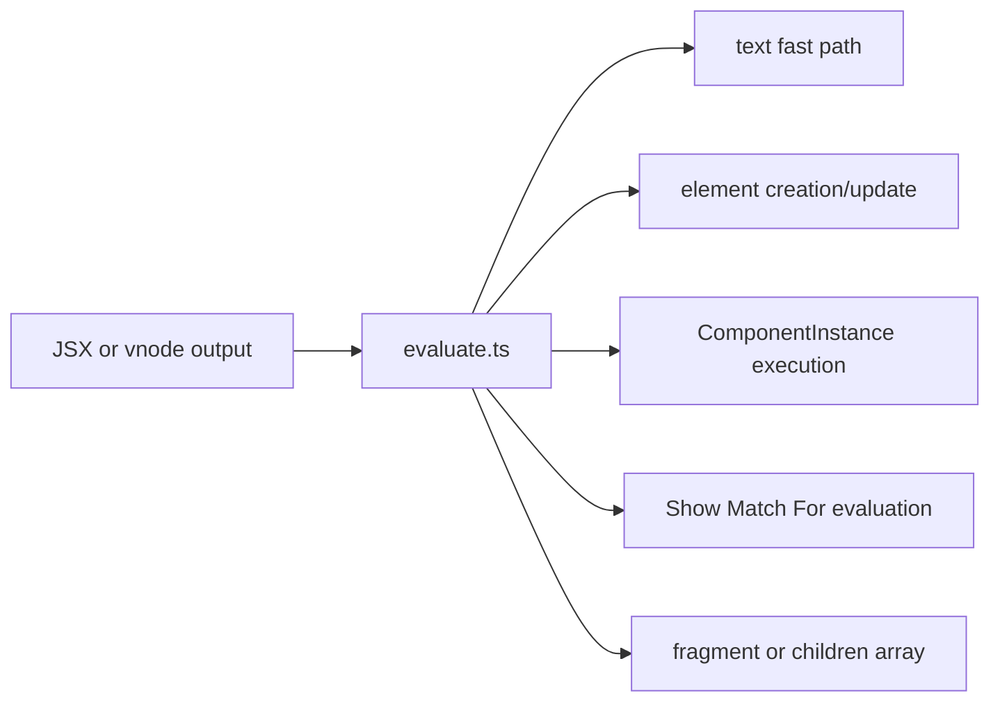
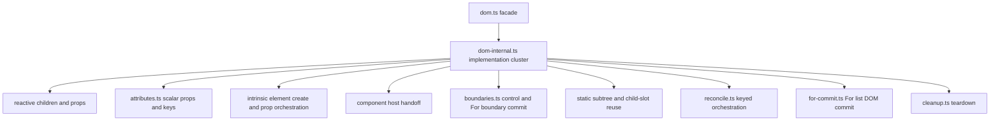
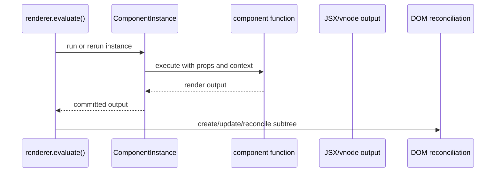
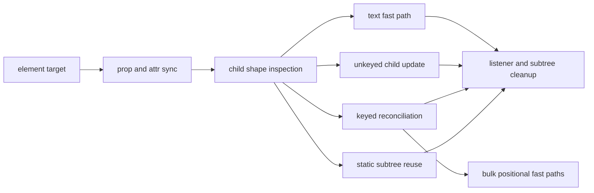

# Internals: Renderer Pipeline

This page documents the DOM-side rendering pipeline in `src/renderer` and the
bridge it uses into the runtime.

## Renderer bridge

The runtime does not hardcode DOM behavior. `src/renderer/index.ts` installs a
renderer host into `src/runtime/runtime.ts`.

```mermaid
flowchart LR
  publicApi[src/index.ts]
  bridge[installRendererBridge()]
  runtime[runtime.ts]
  host[RuntimeRendererHost]
  renderer[renderer evaluate and cleanup methods]

  publicApi --> bridge
  bridge --> runtime
  runtime --> host
  host --> renderer
```

## Evaluation pipeline

`evaluate()` is the central dispatcher. It decides whether a node is text,
element, component, fragment, or control-flow boundary, then routes it to the
right DOM or component path.



## DOM Implementation Ownership

The public renderer entrypoint is intentionally tiny, but the implementation is
not yet fully decomposed. Today the active path routes through
`dom-internal.ts`, which still owns several responsibilities that should become
separate modules.



## Component to DOM handoff

Components do not mutate DOM directly. They produce render output, then hand
that result back to the renderer.



## DOM reconciliation

The renderer has multiple commit strategies depending on node shape. Keyed
lists and bulk text updates take specialized paths.



## Control-flow boundaries

Control primitives are normalized before DOM commit. The runtime computes their
active branch or list state, and the renderer commits the resulting children.


## Cleanup model

Cleanup is a first-class concern because listener ownership and component-owned
subtrees need precise teardown.

```mermaid
flowchart LR
  subtree[DOM subtree]
  listeners[elementListeners]
  instances[component instances under node]
  teardown[teardownNodeSubtree()]
  cleanup[cleanupInstancesUnder()]

  subtree --> teardown
  subtree --> cleanup
  teardown --> listeners
  cleanup --> instances
```

## Design notes

- `src/renderer/evaluate.ts` is the renderer's dispatcher.
- `src/renderer/dom.ts` is the compatibility facade for the DOM renderer.
  `src/renderer/dom-internal.ts` currently owns the active element creation,
  reactive prop/child handling, component-host handoff, and static-subtree
  reuse implementation.
- `src/renderer/attributes.ts` owns scalar prop writes and removals, including
  class token patching, style string/object/null handling, form `value` and
  `checked`, stale attribute removal, static scalar props, and key
  materialization.
- `src/renderer/boundaries.ts` owns control-boundary state evaluation, direct
  control-boundary detection, commit-owner scheduling, and For/Show/Case
  boundary commit orchestration. It uses an explicit DOM host registered by
  `dom-internal.ts` for DOM operations that would otherwise create an import
  cycle.
- `src/renderer/keyed-children.ts` owns keyed vnode snapshots and DOM key-map
  scans shared by the keyed planner and reconciler.
- `src/renderer/namespaces.ts` owns intrinsic DOM namespace matching used when
  the reconciler decides whether an existing element can be reused.
- `src/renderer/reconcile.ts` and `src/renderer/keyed.ts` handle keyed-child
  reuse, movement planning, and commit orchestration.
- `src/renderer/cleanup.ts` owns listener removal and subtree teardown.
- The renderer is deliberately host-shaped so the runtime can stay mostly
  agnostic about DOM details.

## Architecture Review Notes

The renderer diagrams point to two concrete follow-ups:

- `dom-internal.ts` is still the highest-risk renderer file because it mixes
  reactive child ownership, component host reuse, error boundaries, static
  subtree reuse, and child reconciliation.
- Extracted renderer helpers are now active dependencies. Future splits should
  keep helper modules wired into the running path rather than creating parallel
  implementations.

## Related docs

- [Core engine design](./core-engine-design.md)
- [Runtime reactivity](./runtime-reactivity.md)
- [Core: Rendering](../core/rendering.md)
