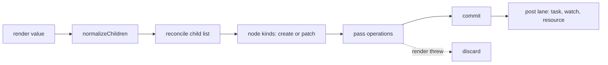

# Internals: Renderer Pipeline

This page covers how a render result becomes DOM: `src/core/view` and
`src/core/dom`. The reactive half (graph, owners, scheduler, components) is in
[runtime reactivity](./runtime-reactivity.md). The design record is
[Core rewrite](./core-rewrite.md), and the module map is
[core source layout](../development/core-layout.md).

## Render, then commit

Every DOM update runs in a **pass** (`src/core/dom/pass.ts`) with two phases.

1. **Render.** Components run, their output is diffed against the committed
   tree, and new DOM is built off-document. Anything that would change live
   DOM or committed renderer state is recorded as an operation on the pass
   instead of being performed.
2. **Commit** applies the operations in order, attaches refs, and queues
   lifecycle work (`task()`, `watch()`, resource starts) in the scheduler's
   `post` lane. **Discard** drops the operations, disposes every owner the pass
   created, and rewinds the render journal (props and scope values changed
   during render).

A render that throws is discarded. Nothing was applied, so nothing is rolled
back, and the last committed DOM stays on screen. If a structural DOM write
fails during commit, the pass restores the child lists it had already changed,
then discards its provisional owners and subscriptions. Standard attribute
writes, input and textarea values, checkbox state, and option selection also
restore their previous values.

Operations are recorded parent-first. A reconcile reserves its slot before its
children record theirs, so a parent places its children before the children
update their own contents.

```mermaid
flowchart LR
  value[render value]
  normalize[normalizeChildren]
  reconcile[reconcile child list]
  kinds[node kinds: create or patch]
  ops[pass operations]
  commit[commit]
  discard[discard]
  post[post lane: task, watch, resource]

  value --> normalize --> reconcile --> kinds --> ops
  ops --> commit --> post
  ops -. render threw .-> discard
```

## Roots

`createRoot()` (`src/core/dom/root.ts`) renders a value into a container and
owns everything it renders. `prepare()` runs the render phase and returns work
that is committed or discarded as a unit. A caller updating several roots (a
navigation) can commit all of them or none. `render()` prepares and commits in
one step, and `dispose()` removes the content and ends every lifetime it owns.
Each root registers its container for event delegation and provides a default
portal channel.

## Child descriptors

`normalizeChildren()` (`src/core/view/children.ts`) flattens a render result
into descriptors: text, an element, a component, a fragment, a function child
(fine-grained dynamic content), or a portal. The DOM renderer and the SSR
renderer both consume these descriptors, so they cannot disagree about what a
value renders.

## The rendered tree

`src/core/dom/tree.ts` is the renderer's record of what each child slot
produced and where its DOM lives. It is the only owner of DOM position.

A component, fragment, or function child has no DOM of its own; its DOM is its
children's. A multi-node result needs no wrapper element and no marker comments:
its nodes are found by walking its children, and the insertion point after it by
walking its following siblings.

Lifetimes are not tracked here. A tree node points at the owner that holds its
lifetime, such as a component instance, a binding, or a function child's
computation. Deep trees are walked iteratively, so long transparent component
chains do not consume the JavaScript call stack.

## Reconciliation

`src/core/dom/reconcile.ts` matches a new descriptor list against a parent's
committed children: by key, else by type in order. It asks the node kinds to
patch matches and create the rest, then records one operation that removes
departed children and places the remaining ones with a single
longest-increasing-subsequence move pass. There is one keyed reconciler;
`For` rows go through it like any other keyed children.

The reconciler knows lists, not node kinds. `src/core/dom/nodes.ts` owns how
each kind is created, patched, and released. Releasing ends the lifetimes a
removed node owns after the reconciler has detached its DOM. Teardown failures
are reported after the update and never thrown into it
(`src/core/dom/teardown.ts`).

## Standalone updates

A component or function child whose own reads changed re-renders in its own
pass, independent of its parent (`src/core/dom/updates.ts`). A failure discards
only that pass. Other readers updated in the same flush commit on their own. The
error goes to the nearest `ErrorBoundary` above it. Without a boundary, it
propagates to the scheduler, which reports it after the flush.

## Props, bindings, and events

`src/core/dom/props.ts` decides what each prop is: an attribute value, an event
handler, a ref, or a binding. On a new, detached element props are written
directly. On a committed element every write is recorded as a pass operation. A
function-valued prop other than a handler or ref is a **binding**: a
computation owned by the element's component that re-applies the prop in the
`effect` lane when what it reads changes.

How a value is written lives in `prop-values.ts` (class tokens, owned style
properties, form state, DOM properties, URL-guarded attributes, and the
`attr:`/`prop:` escape hatches), `dom-properties.ts`, and
`element-attributes.ts`. SSR attribute serialization shares these semantics.

`src/core/dom/events.ts` delegates bubbling UI events (click, input, keyboard,
mouse, touch). Each app root, plus `document.body` for content rendered outside
any root, listens once per event type. When an event reaches a container, the
handlers along its path are snapshotted and run target-first in one `batch()`.
State writes flush once, synchronously, after the last handler, and a handler
that removes an ancestor does not stop that ancestor's handler for the same
event. Other events and capture handlers get one direct listener per element.
A handler runs with its component as the current owner. A throwing handler is
reported like an uncaught listener exception.

## Hydration

Hydration is rendering with a cursor (`src/core/dom/hydration.ts`). During a
root's first render with `hydrate`, each container has a cursor at its next
unclaimed child. Creating a node first tries to claim the node under the
cursor: an element with the same tag, or a text node (split when the server
merged adjacent texts). A node that does not match is created fresh. When a
container's children are rendered, one commit operation puts the claimed and
created nodes in order and removes server nodes the client did not render.
Markup marked `data-skip-hydrate` stays dormant until it is activated.

## Portals

A portal channel (`src/core/api/portal.ts`) holds the latest writer and its
content. A writer records its content when its render commits. The host
renders that content at its own position, owned by the writer, so the content
lives and dies with the writer and reads the writer's scopes. When a writer's
lifetime ends, it clears the channel only if it is still the current writer.

## Related docs

- [Core rewrite](./core-rewrite.md)
- [Runtime reactivity](./runtime-reactivity.md)
- [SSR and SSG pipeline](./ssr-ssg-pipeline.md)
- [Core source layout](../development/core-layout.md)
