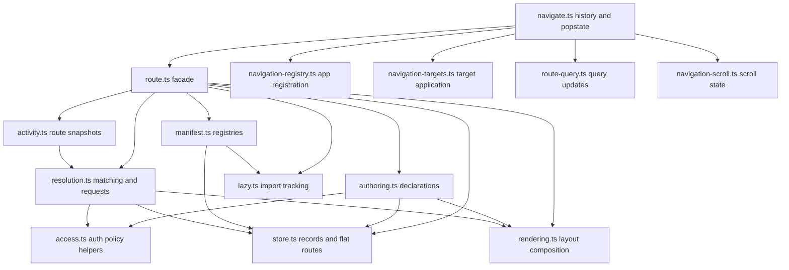

# Router Internals: Normalized Manifest Model

## Motivation

All routing modes - SPA navigation, SSR request resolution, and SSG page expansion - share the
same fundamental needs: find the best-matching route for a path, extract params, apply layouts,
and expose metadata. Rather than having separate representations for each mode, Askr routes are
compiled into a single normalized `RouteManifest` at **module load time**. Every runtime
consumes this manifest.

## How the manifest is built

Route declarations run as side effects when the routes module is imported:

```ts
// routes.ts
import { fallback, group, route } from '@askrjs/askr/router';

group({ layout: AppLayout }, () => {
  route('/posts/{slug}', PostPage, {
    entries: async () =>
      getPosts().map((p: { slug: string }) => ({ slug: p.slug })),
  });
  fallback(NotFound);
});
```

Internally, `src/router/route.ts` is a compatibility facade. Ownership is split
across focused modules:

- `authoring.ts` owns route declaration helpers and path/access validation.
- `store.ts` owns module-level route records, flat routes, namespaces, auth
  defaults, and registration locking.
- `manifest.ts` creates registries and applies manifests into the store.
- `rendering.ts` composes route, page, layout, and `Outlet` handlers.
- `resolution.ts` owns matching, request resolution, and activity-match
  computation.
- `activity.ts` owns `currentRoute()` snapshots and active-route state.
- `navigate.ts` owns browser history and popstate orchestration.
- `navigation-registry.ts` owns app registration and route snapshot
  synchronization.
- `navigation-targets.ts` owns route request cancellation, target resolution,
  and target application.
- `route-query.ts` owns URL query update helpers.

The authoring flow is:

1. `group({ layout: Component }, fn)` pushes a `LayoutScopeRecord` onto the scope stack and pops it when
   `fn` returns.
2. Each `route(path, Component, options?)` call:
   - Validates the path (rejects `:name` syntax, requires `/` prefix)
   - Parses the path into a `ParsedSegment[]` list via `parseSegments()`
   - Computes a deterministic `rank` (specificity score) via `computeRank()`
   - Snapshots the current layout scope stack as the route's `layoutChain`
   - Auto-composes a `RouteHandler` that renders the page inside the layout chain
   - Appends a `RouteRecord` to the `store.ts` record list and also registers
     the handler in the legacy flat route list for backward-compatible
     resolution

## Module ownership

The router split is the model the remaining runtime and renderer cleanup should
move toward: the facade is small, and each extracted module owns active
behavior used by the pipeline.



## RouteRecord structure

```ts
interface RouteRecord {
  path: string; // e.g. '/posts/{slug}'
  component: RouteComponent; // the page function
  segments: ParsedSegment[]; // [{kind:'static',...}, {kind:'param',...}]
  rank: number; // precomputed specificity score
  layoutChain: LayoutScopeRecord[]; // outermost -> innermost
  options: RouteOptions; // load, entries, guard, title, namespace
  isFallback: boolean; // true only for '/*'
  handler: RouteHandler; // composed render function used by all modes
}
```

## Specificity scoring

| Segment kind       | Points |
| ------------------ | ------ |
| `static` (literal) | 3      |
| `param` (`{name}`) | 2      |
| `wildcard` (`*`)   | 1      |
| `catchall` (`/*`)  | 0      |

Sum of segment scores = route rank. Higher rank wins when multiple routes match a path.

## How each mode consumes the manifest

### SPA navigation

`createSPA({ registry })` uses the registry manifest and flat routes together.
When only a manifest is passed, `_applyManifest()` populates the two runtime
stores:

- flat routes - legacy handler list used by direct route-table resolution
- records - parsed records used by request resolution, metadata, layouts, and
  future manifest extensions

When `navigate(path)` fires, `navigation-targets.ts` starts a route request,
uses `resolveRouteRequest()` to find the best record, and returns its renderer
handler. The renderer handler has the layout chain baked in, but defers matched
page-shell and leaf component execution until their layout context is active.
`navigate.ts` does not need to know about layouts.

`RouteRecord.handler` remains the eager low-level handler used by
`resolveRoute()`, manifest inspection, and flat route tables. Keeping that
contract separate from renderer composition preserves direct handler behavior
without executing routed leaves before layout providers render.

### SSR request resolution

`renderToString({ url, registry })` uses the registry route table for route
matching and keeps request state in render context. Flat route tables are still
supported for compatibility:

```ts
routes: getManifest().records.map((r) => ({
  path: r.path,
  handler: r.handler,
  namespace: r.options.namespace,
}));
```

### SSG expansion

The SSG pipeline walks `RouteManifest.records`. Records with `options.entries` are expanded:
`entries()` returns one param map per page. Each map is interpolated into the path template
(`/posts/{slug}` + `{ slug: 'hello' }` -> `/posts/hello`) to produce a concrete `RouteConfig`.

## Invariants

- Route records are always produced in **declaration order** (insertion order within scope).
- Equal-rank routes are resolved by insertion order (first declared wins).
- `clearRoutes()` resets the flat routes, records, namespace set, auth defaults,
  registration stacks, lazy import tracking, and registration lock.
- Registration is locked after `createSPA` / `hydrateSPA` in production (not in tests).
- The manifest is statically representable: it contains no closures that reference dynamic
  runtime state, making it suitable for serialization and pre-compilation in future tooling.
