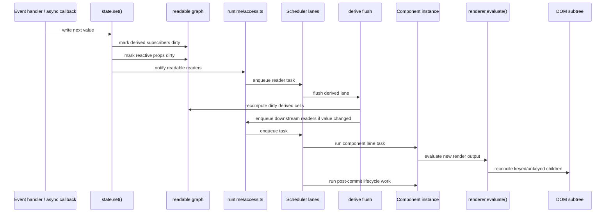
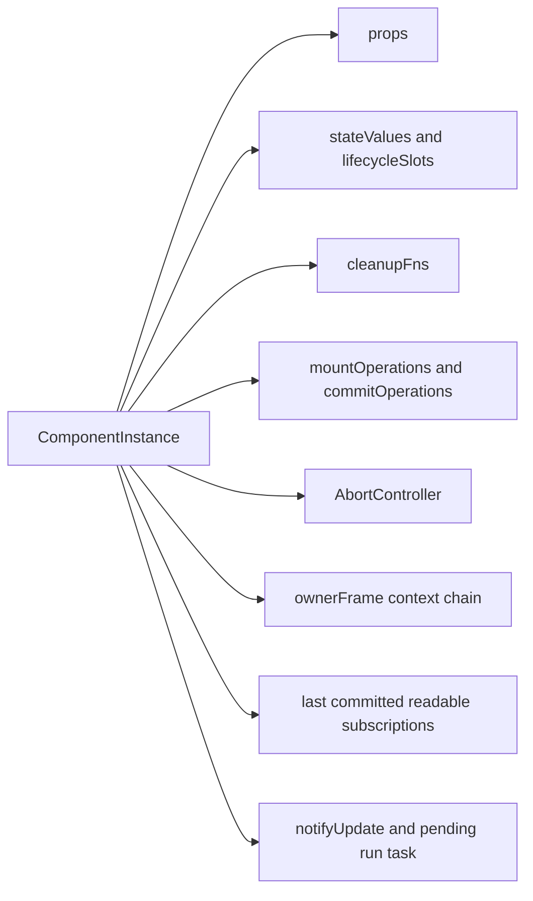
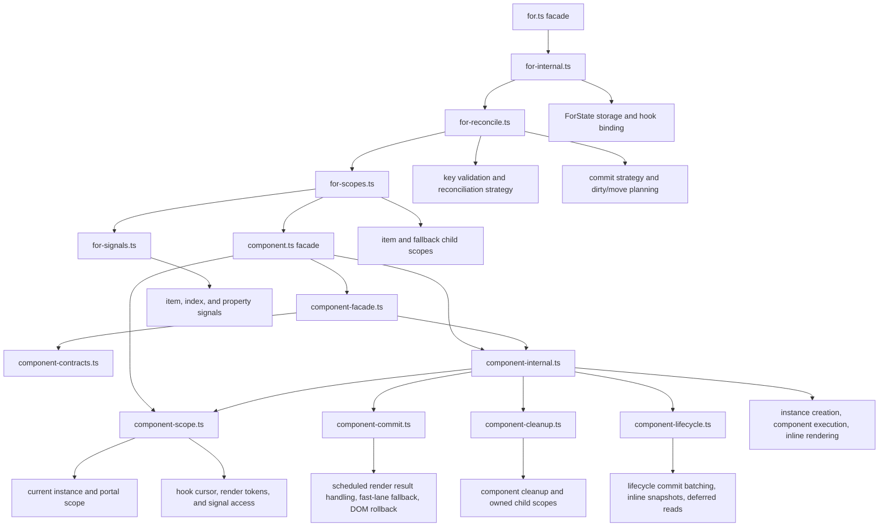
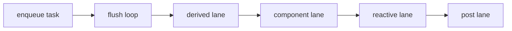
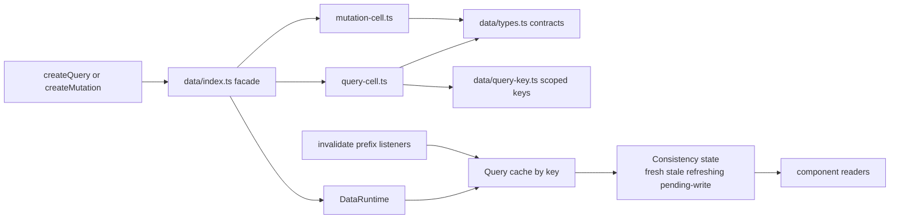

# Internals: Runtime Reactivity

This page focuses on the reactive core in `src/runtime` and `src/data`.
The goal is to show how state, derived values, component instances, resources,
and the shared data runtime interact.

## Reactive update pipeline

The runtime is intentionally serialized. Writes do not mutate the DOM directly;
they dirty sources, enqueue work, and let the scheduler flush in a deterministic
order.



## Runtime ownership model

`ComponentInstance` is the runtime's ownership boundary. Hook state, cleanup,
abort semantics, and readable subscriptions all hang off the instance.



## Component and For Implementation Ownership

The runtime public import paths remain stable while their active
implementations live behind facades. `For` item scopes depend on component hook
indexing and child-scope ownership, so that relationship should stay explicit
when the implementation is split further.



`runtime/index.ts` is now the stable internal facade for non-runtime areas.
`component.ts` remains the narrow component-facing entrypoint, while
`component-facade.ts` and `component-contracts.ts` hold the stable helper
surface used by renderer and SSR code. `portal.ts` owns the default portal
inventory that foundations re-export publicly. `selector-store.ts` owns the
dirty-selector flush queue used by `selector.ts`.

## Readable graph

State and derived values are two kinds of readable source feeding the same
dependency graph.

```mermaid
flowchart LR
  state[state()]
  derive[derive()]
  readable[ReadableSource graph]
  component[Component render readers]
  reactiveProps[reactive prop dirtiness]
  scheduler[Scheduler]
  access[runtime/access.ts]

  state --> readable
  derive --> readable
  readable --> component
  readable --> reactiveProps
  readable --> access
  access --> scheduler
```

## Scheduler lanes

The scheduler enforces flush order explicitly. Derived work settles before
component rerenders, and post-commit work runs after DOM evaluation.



## Lifecycle-bound async resources

`resource()` is a component-scoped async primitive. It wraps async work in a
`ResourceCell`, ties cancellation to component lifecycle, and exposes a stable
snapshot object.

```mermaid
flowchart LR
  component[Component render]
  resourceHook[resource() in runtime/resource-operation.ts]
  cell[ResourceCell]
  abort[AbortController]
  loader[loader fn with signal]
  snapshot[snapshot value pending error refresh]
  rerender[subscriber-triggered rerender]

  component --> resourceHook
  resourceHook --> cell
  cell --> abort
  cell --> loader
  loader --> snapshot
  cell --> snapshot
  snapshot --> rerender
```

## Shared query and mutation runtime

The data layer is separate from `resource()`. It is keyed, shared, and cache
oriented rather than purely lifecycle oriented.



## Design notes

- `src/runtime/component.ts` is the compatibility facade for the component
  runtime. `src/runtime/component-scope.ts` owns current-instance and
  portal-scope state, hook cursor and order validation, render-token helpers,
  and component signal access. `src/runtime/component-commit.ts` owns
  scheduled render result handling, fast-lane fallback, placeholder
  replacement, target DOM evaluation, and rollback.
  `src/runtime/component-internal.ts` owns instance creation, component
  function execution, and inline rendering. `src/runtime/component-cleanup.ts`
  owns cleanup, strict cleanup aggregation, and owned child scopes.
  `src/runtime/component-lifecycle.ts` owns lifecycle commit batching, inline
  render snapshots, deferred read subscription commits, mount and commit
  operation settlement, and commit discard.
- `src/runtime/for.ts` is the compatibility facade for `For` runtime state.
  `src/runtime/for-internal.ts` owns state storage, hook binding, source effect
  cleanup registration, source evaluation, and DOM update state clearing.
  `src/runtime/for-reconcile.ts` owns development key validation,
  reconciliation strategy selection and execution, benchmark fast-lane/timing
  recording, and commit planning fields. `src/runtime/for-scopes.ts` owns
  per-item scope creation/render/update/disposal, index-signal synchronization,
  fallback scope rendering/disposal, and removed-node bookkeeping.
  `src/runtime/for-signals.ts` owns reactive item/index signals, property proxy
  reads, signal notification, and parent-reader pruning.
- `src/runtime/state.ts` stores component-local writable cells.
- `src/runtime/derive.ts` tracks dependency reads and recomputes in the
  scheduler's `derived` lane.
- `src/runtime/readable.ts` is the shared substrate connecting state, derived
  values, reactive props, and component readers.
- `src/runtime/access.ts` is the internal boundary for default scheduler and
  renderer-host access used by runtime, renderer, data, and FX hot paths.
- `src/runtime/operations.ts` is the stable operations facade.
  `src/runtime/resource-operation.ts` owns the component-bound `resource()`
  wrapper around `ResourceCell`, while `src/runtime/lifecycle-operations.ts`
  owns `on()`, `timer()`, `task()`, `capture()`, and lifecycle predicates.
  `src/runtime/resource-cell.ts` remains intentionally component-agnostic.
- `src/data/index.ts` is the stable data facade. `src/data/data-runtime.ts`
  owns keyed cache runtime state, default runtime resolution, and slot stores.
  `src/data/query-cell.ts` owns `QueryCell` and `createQuery()`,
  `src/data/mutation-cell.ts` owns `MutationCell` and `createMutation()`, and
  `src/data/invalidation.ts` owns invalidation helpers and interval
  invalidation. `src/data/types.ts` holds the public and internal contracts,
  `src/data/query-key.ts` owns scoped key serialization, and
  `src/data/shared.ts` owns readable notification and async error helpers
  shared by query and mutation cells.

## Architecture Review Notes

The runtime diagrams are backed by architecture checks:

- Component, `For`, and data helpers have explicit owner-module ceilings rather
  than temporary cluster exemptions.
- `For` depends on component hook indexing from `component-scope.ts` and
  child-scope cleanup from `component-cleanup.ts`. That coupling is legitimate,
  but it should stay behind explicit contract modules so future splits do not
  reach back into component internals.

## Related docs

- [Core engine design](./core-engine-design.md)
- [Core: Data](../core/data.md)
- [Concepts: Determinism](../concepts/determinism.md)
