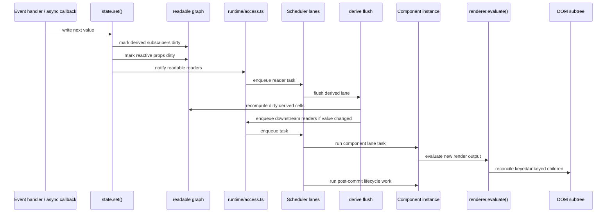
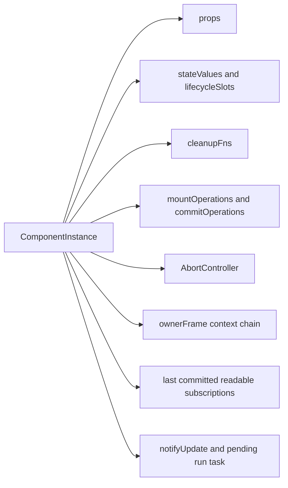
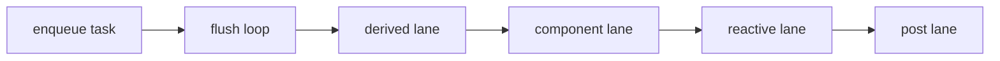
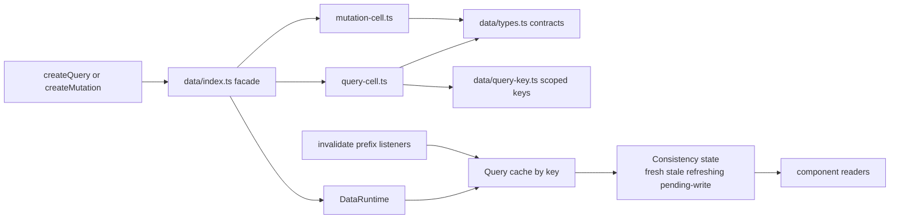

# Internals: Runtime Reactivity

This page focuses on the reactive core in `src/runtime` and `src/data`.
The goal is to show how state, derived values, component instances, resources,
and the shared data runtime interact.

## Reactive update pipeline

The runtime is intentionally serialized. Writes do not mutate the DOM directly;
they dirty sources, enqueue work, and let the scheduler flush in a deterministic
order.

Allocation-sensitive fine-grained effects keep one source in the primary slot
and the second source in a companion slot. A collection is created only when a
third distinct source is read. Keyed `For` item proxies use the same shape for
coalesced property reads, so ordinary two-property rows retain precise item
invalidation without allocating a property array. Child-scope scheduler tasks
are also created lazily: a scope that has no readable subscriptions on its
initial render does not retain a flush closure.



## Runtime ownership model

`ComponentInstance` is the runtime's ownership boundary. Hook state, cleanup,
abort semantics, and readable subscriptions all hang off the instance.



## Component and For Implementation Ownership

Published runtime contracts live in the compatibility adapter. Internal modules
use leaf execution, lifetime, scheduling, and host capabilities. The former
component facades have been removed; `runtime/index.ts` exports the internal
capabilities used by other subsystems.

`component/instance.ts` owns synchronous execution and inline rendering.
`component/scope.ts` owns the current component, portal scope, and hook cursor.
`ownership/record.ts` owns the lifetime graph and iterative disposal, while
`component/cleanup.ts` supplies component-specific invalidation and settlement.
`component/generation.ts` prepares, restores, and retires exact root lifetimes.
Boot cleanup retires the root registration and captures its cleanup callbacks
before invoking user code. A callback can mount a replacement on the same element;
the retiring lifetime cannot erase its registration, callbacks, or hydration
boundaries. During an update, such a replacement supersedes the interrupted mount.
The `innerHTML = ''` cleanup entry point also preserves a replacement mounted
during teardown instead of applying the old lifetime's pending DOM clear.
Unsubscribing an old root callback affects only its captured callback collection.

`For` reconciliation maintains keyed membership and delegates host application
to renderer capabilities. Item scopes attach their existing lifetime record to
the collection owner; no second mutable child ownership model is maintained.
Ordinary component children join the same graph. Resources and data subscriptions
register cleanup against the captured lifetime.

`transactions/coordinator.ts` owns every commit's preparation, reversible
application, publication, and settlement. Scheduled and inline execution
contribute participants to that protocol. Renderer fast paths only specialize
host work. `portal/portal.ts` owns portal inventory, and `reactivity/selector-store.ts` owns
the dirty-selector queue.

`scheduled-work.ts` owns coalesced flush tickets for derived values, selectors,
and effects. A ticket is released before execution, on rejected admission
(including production's silent rejection), and when the scheduler clears its
queued task. A later invalidation can therefore schedule fresh work. Reentrant
writes can request another flush without duplicating an already queued ticket.

Dirty membership remains with each reactive subsystem; it is not proof that a
scheduler task exists. Derived and selector batch flags track pending downstream
notification, while effects use their existing per-lane dirty sets directly.
Clearing scheduler work does not revert state values or discard these dirty
records. The next source write can resume propagation of the current value.
Ordinary scheduler tasks retain their existing multiplicity and lane ordering.

## Readable graph

State and derived values are two kinds of readable source feeding the same
dependency graph.

```mermaid
flowchart LR
  state[state()]
  derive[derive()]
  readable[ReadableSource graph]
  component[Component render readers]
  reactiveProps[reactive prop dirtiness]
  scheduler[Scheduler]
  access[runtime/access.ts]

  state --> readable
  derive --> readable
  readable --> component
  readable --> reactiveProps
  readable --> access
  access --> scheduler
```

## Scheduler lanes

The scheduler enforces flush order explicitly. Derived work settles before
component rerenders, and post-commit work runs after DOM evaluation.



## Lifecycle-bound async resources

`resource()` is a component-scoped async primitive. It wraps async work in a
`ResourceCell`, ties cancellation to component lifecycle, and exposes a stable
snapshot object.

Each execution owns its controller and checks that ownership after abort
callbacks, pending notifications, and loader completion. Refresh, abort, or
disposal during those callbacks prevents the superseded execution from running
or publishing a result, including synchronous values and errors. Subscriber
failures are reported separately and do not become loader errors or prevent
other subscribers from observing the published snapshot. Thenable inspection
belongs to loader execution, so a throwing `then` getter publishes a loader
error through the same snapshot contract.

```mermaid
flowchart LR
  component[Component render]
  resourceHook[resource() in runtime/lifecycle/resource.ts]
  cell[ResourceCell]
  abort[AbortController]
  loader[loader fn with signal]
  snapshot[snapshot value pending error refresh]
  rerender[subscriber-triggered rerender]

  component --> resourceHook
  resourceHook --> cell
  cell --> abort
  cell --> loader
  loader --> snapshot
  cell --> snapshot
  snapshot --> rerender
```

## Shared query and mutation runtime

The data layer is separate from `resource()`. It is keyed, shared, and cache
oriented rather than purely lifecycle oriented.



## Design notes

- `src/runtime/component/scope.ts` owns current-instance and
  portal-scope state, hook cursor and order validation, render-token helpers,
  and component signal access. `src/runtime/component/commit.ts` owns
  scheduled preparation and renderer strategy selection. Renderer capabilities
  own placeholder replacement, target updates, and host restoration.
  `src/runtime/component/instance.ts` owns execution and inline rendering;
  `ownership/record.ts` drains all lifetimes through one iterative path, with component
  phases supplied by `component/cleanup.ts`.
  Disposal preparation failures are reported after the remaining ownership
  graph drains. A failed compatibility child index falls back to the linked
  graph; a failed lifecycle phase factory falls back to ordinary owned cleanup,
  cancellation, and finalization. Component scope is entered in the protected
  begin phase and restored in finish. Repeated disposal remains a no-op.
  `transactions/coordinator.ts` owns preparation, reversible application,
  publication, and settlement. Nested transactions join their enclosing commit.
  Each transaction has one active commit operation. Recursive commit calls on
  that transaction do nothing; distinct nested transactions still join normally.
  Discard during application, publication, or participant merge stops that
  operation and remains terminal, without later settlement or activation.
  `transactions/render.ts` contributes reversible subscription and execution
  snapshots; `lifecycle/settlement.ts` captures lifecycle work for
  its exact owner before callbacks run. Failed application or publication
  restores framework state. After publication, cleanup and lifecycle errors
  are drained without undoing user side effects.
- `src/runtime/control/for.ts` is the compatibility facade for `For` runtime state.
  `src/runtime/control/for-state.ts` owns state storage, hook binding, source effect
  cleanup registration, source evaluation, and DOM update state clearing.
  `src/runtime/control/for-reconcile.ts` owns development key validation,
  reconciliation strategy selection and execution, benchmark fast-lane/timing
  recording, and commit planning fields. `src/runtime/control/for-scopes.ts` owns
  per-item scope creation/render/update/disposal, index-signal synchronization,
  fallback scope rendering/disposal, and removed-node bookkeeping.
  `src/runtime/control/for-signals.ts` owns reactive item/index signals, property proxy
  reads for object/function row items, native array pass-through, signal
  notification, and parent-reader pruning.
- `src/runtime/reactivity/state.ts` stores component-local writable cells.
  Optimized DOM reorders use the same coordinator with deferred notifications.
  State values change immediately; derived invalidation and reader notification
  drain once per source after commit or restoration. Ordinary updates retain
  their existing notification timing.
- `src/runtime/reactivity/derive.ts` tracks dependency reads and recomputes in the
  scheduler's `derived` lane.
- `src/runtime/reactivity/readable.ts` is the shared substrate connecting state, derived
  values, reactive props, and component readers.
- `src/runtime/access.ts` is the internal boundary for default scheduler and
  renderer-host access used by runtime, renderer, data, and FX hot paths.
- `src/runtime/operations.ts` is the stable operations facade.
  `src/runtime/lifecycle/resource.ts` owns the component-bound `resource()`
  wrapper around `ResourceCell`, while `src/runtime/lifecycle/operations.ts`
  owns `on()`, `timer()`, `task()`, `capture()`, and lifecycle predicates.
  `src/runtime/lifecycle/resource-cell.ts` remains intentionally component-agnostic.
- `src/data/index.ts` is the stable data facade. `src/data/data-runtime.ts`
  owns keyed cache runtime state, default runtime resolution, and slot stores.
  `src/data/query-cell.ts` owns `QueryCell` and `createQuery()`,
  `src/data/mutation-cell.ts` owns `MutationCell` and `createMutation()`, and
  `src/data/invalidation.ts` owns invalidation helpers and interval
  invalidation. `src/data/types.ts` holds the public and internal contracts,
  `src/data/query-key.ts` owns scoped key serialization, and
  `src/data/shared.ts` owns readable notification and async error helpers
  shared by query and mutation cells.

## Architecture Review Notes

The runtime diagrams are backed by architecture checks:

- Component, `For`, and data helpers have explicit owner-module ceilings rather
  than temporary cluster exemptions.
- `For` depends on component hook indexing from `component/scope.ts` and
  child-scope cleanup from `component/cleanup.ts`. That coupling is legitimate,
  but it should stay behind explicit contract modules so future splits do not
  reach back into component internals.

## Related docs

- [Core engine design](./core-engine-design.md)
- [Core: Data](../core/data.md)
- [Concepts: Determinism](../concepts/determinism.md)
