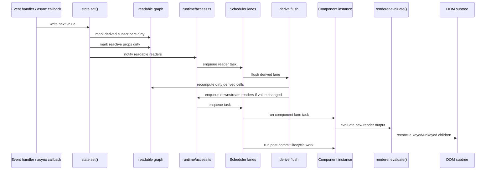
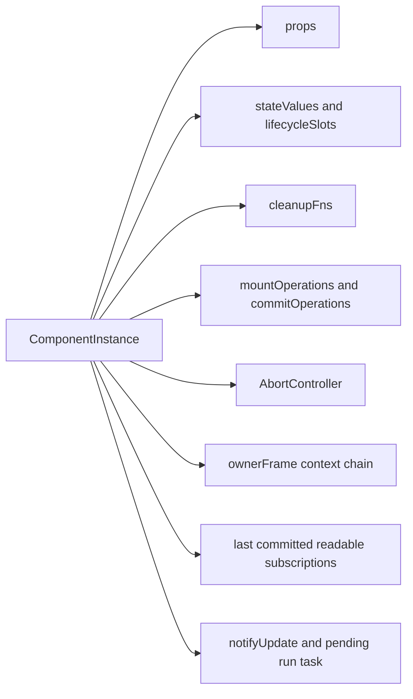
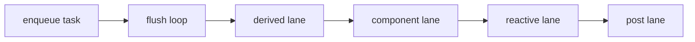
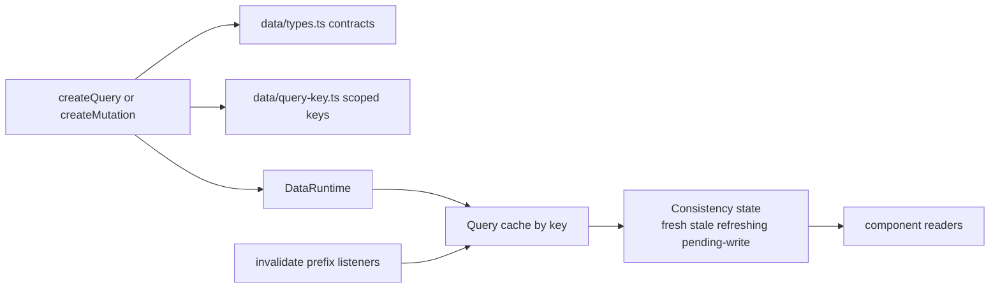

# Internals: Runtime Reactivity

This page focuses on the reactive core in `src/runtime` and `src/data`.
The goal is to show how state, derived values, component instances, resources,
and the shared data runtime interact.

## Reactive update pipeline

The runtime is intentionally serialized. Writes do not mutate the DOM directly;
they dirty sources, enqueue work, and let the scheduler flush in a deterministic
order.



## Runtime ownership model

`ComponentInstance` is the runtime's ownership boundary. Hook state, cleanup,
abort semantics, and readable subscriptions all hang off the instance.



## Readable graph

State and derived values are two kinds of readable source feeding the same
dependency graph.

```mermaid
flowchart LR
  state[state()]
  derive[derive()]
  readable[ReadableSource graph]
  component[Component render readers]
  reactiveProps[reactive prop dirtiness]
  scheduler[Scheduler]
  access[runtime/access.ts]

  state --> readable
  derive --> readable
  readable --> component
  readable --> reactiveProps
  readable --> access
  access --> scheduler
```

## Scheduler lanes

The scheduler enforces flush order explicitly. Derived work settles before
component rerenders, and post-commit work runs after DOM evaluation.



## Lifecycle-bound async resources

`resource()` is a component-scoped async primitive. It wraps async work in a
`ResourceCell`, ties cancellation to component lifecycle, and exposes a stable
snapshot object.

```mermaid
flowchart LR
  component[Component render]
  resourceHook[resource() in runtime/operations.ts]
  cell[ResourceCell]
  abort[AbortController]
  loader[loader fn with signal]
  snapshot[snapshot value pending error refresh]
  rerender[subscriber-triggered rerender]

  component --> resourceHook
  resourceHook --> cell
  cell --> abort
  cell --> loader
  loader --> snapshot
  cell --> snapshot
  snapshot --> rerender
```

## Shared query and mutation runtime

The data layer is separate from `resource()`. It is keyed, shared, and cache
oriented rather than purely lifecycle oriented.



## Design notes

- `src/runtime/component.ts` is the compatibility facade for the component
  runtime. The lifecycle, render execution, and cleanup implementation now live
  behind that stable entrypoint.
- `src/runtime/state.ts` stores component-local writable cells.
- `src/runtime/derive.ts` tracks dependency reads and recomputes in the
  scheduler's `derived` lane.
- `src/runtime/readable.ts` is the shared substrate connecting state, derived
  values, reactive props, and component readers.
- `src/runtime/access.ts` is the internal boundary for default scheduler and
  renderer-host access used by runtime, renderer, data, and FX hot paths.
- `src/runtime/resource-cell.ts` is intentionally component-agnostic. The
  component binding lives in `src/runtime/operations.ts`.
- `src/data/index.ts` provides the keyed cache runtime for app data and
  eventual-consistency workflows. `src/data/types.ts` holds the public and
  internal contracts, `src/data/query-key.ts` owns `queryScope()` key
  serialization, and `src/data/shared.ts` owns readable notification and async
  error helpers shared by query and mutation cells.

## Related docs

- [Core engine design](./core-engine-design.md)
- [Core: Data](../core/data.md)
- [Concepts: Determinism](../concepts/determinism.md)
