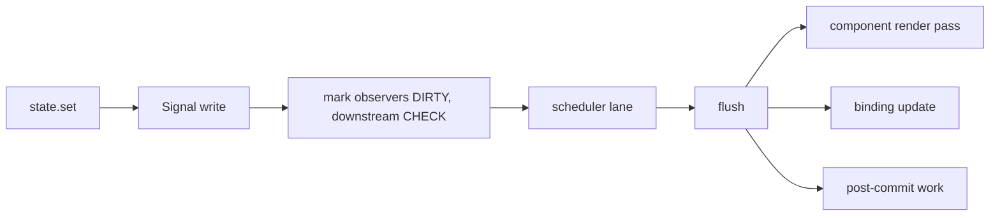
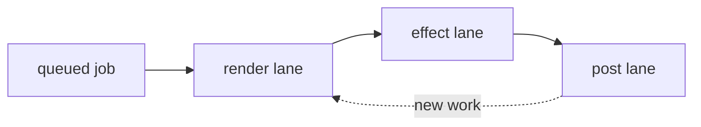
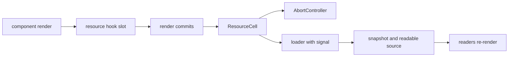
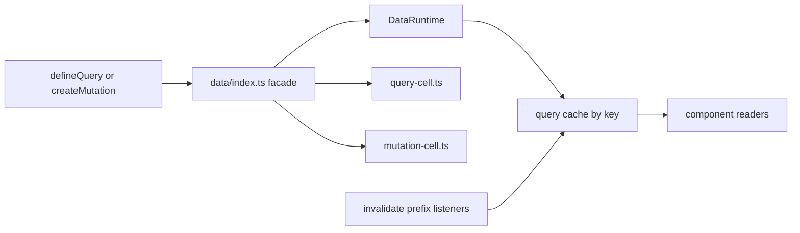

# Internals: Runtime Reactivity

This page covers the reactive half of the core: `src/core/reactive`,
`src/core/component`, the primitives in `src/core/api`, and the shared data
runtime in `src/data`. The DOM half is in the
[renderer pipeline](./renderer-pipeline.md). The design record is
[Core rewrite](./core-rewrite.md).

## Reactive update pipeline

Writes never touch the DOM directly. A write marks what read the source as
stale, the scheduler queues the stale work, and a flush runs it in a fixed
order.

```mermaid
flowchart LR
  write[state.set]
  signal[Signal write]
  mark[mark observers DIRTY, downstream CHECK]
  queue[scheduler lane]
  flush[flush]
  render[component render pass]
  binding[binding update]
  post[post-commit work]

  write --> signal --> mark --> queue --> flush
  flush --> render
  flush --> binding
  flush --> post
```

## Reactive graph

`src/core/reactive/graph.ts` has two node types:

- A **`Signal`** holds a value. `state()` cells are signals. A write that
  passes the equality check notifies the signal's observers.
- A **`Computation`** runs a function and records every source it read in
  that run. `derive()`, `selector()`, fine-grained bindings, `watch()`, and
  component renders are all computations. There is one subscriber kind;
  they differ only in how they are scheduled when they go stale.

A write marks direct observers `DIRTY` and everything downstream `CHECK`.
When a computation is read or run by the scheduler, it first brings its
`CHECK` sources up to date and re-runs only if one of them actually changed.
Updates are glitch-free, and an unchanged derived value stops propagation.

A computation with no scheduler (a `derive()` value) is lazy: it recomputes
only when read. A computation with a scheduler queues itself when it goes
stale. Reading a computation from inside its own run throws
`Circular reactive dependency detected.`

`src/core/reactive/readable.ts` brands readables. A function prop or child
that returns a readable renders the readable's value.

## Owner tree

`src/core/reactive/owner.ts` defines `Owner`. Every lifetime is an owner: a
root, a component instance, a control boundary, a `For` row, a binding, and a
computation. An owner has a parent, children, cleanups, and scope values.

Disposal runs children first, in reverse creation order, then the owner's
own cleanups in reverse registration order. It always finishes: failures are
collected and reported together rather than stopping teardown.
`runWithOwner()` sets the owner for code that runs later, such as event
handlers and queued tasks, so scope reads and cleanup registration still work
there.

Lexical scopes (`src/core/api/scope.ts`) are values recorded on a provider's
owner. `readScope()` walks up the owner tree from the running code.

## Components and hooks

`src/core/component/instance.ts` defines `ComponentInstance`, an owner that
persists across renders. Its render is a computation: the component function
runs with a hook cursor at zero, its reads are tracked, and a change to
anything it read schedules the instance in the `render` lane.

Hooks claim positional slots by call order. A later render must claim the same
hook kinds in the same order, or it throws `HookOrderChangeError`. The hook kit
in `src/core/api/hooks.ts` is how primitives outside the core (data queries,
route activity, lifecycle helpers) own state across renders. A hook claims a
slot, registers work that runs after commit, and ties cleanup to the instance.

While a component render or function child is executing, state writes are
rejected (`src/core/component/render-state.ts`), because they would re-trigger
the render. The render journal (`src/core/component/journal.ts`) records the
props and scope values a render changed so a discarded pass can put them back.

The component layer reaches the DOM only through the `RenderHost` interface,
which `src/core/dom` installs.

## Control flow

`Show`, `Case`/`Match`, and `For` (`src/core/api/control.ts`) are ordinary
components. Each renders lazily in its own lifetime, reads its sources in its
own render, and never claims hook slots in the component that uses it, so
controls work under conditionals, early returns, and loops.

A `Show` or `Case` branch is wrapped in a keyed fragment. Switching branches
replaces the branch's lifetime instead of patching one branch's DOM into the
other's. Each `For` row is a `ForRow` component keyed by `by` (or by position
with `byIndex`). A row re-renders only when its item or the row callback
changes. Keys are validated per render, and the rows are placed by the
renderer's single keyed reconciler. See
[control-flow primitive design](./for-primitive-design.md).

## Scheduler lanes

`src/core/reactive/scheduler.ts` queues stale work into three lanes:

| Lane     | Work                                                                            | Order                                                                                     |
| -------- | ------------------------------------------------------------------------------- | ----------------------------------------------------------------------------------------- |
| `render` | Component and control renders                                                   | Shallowest owner first, so a parent re-render can absorb or remove a child before it runs |
| `effect` | Fine-grained DOM bindings                                                       | Queue order                                                                               |
| `post`   | Work that follows a commit: `task()`, `watch()`, resource starts, `queueTask()` | Queue order                                                                               |

```mermaid
flowchart LR
  queue[queued job]
  render[render lane]
  effect[effect lane]
  post[post lane]

  queue --> render --> effect --> post
  post -. new work .-> render
```

A flush always takes the next job from the highest-priority non-empty lane,
so render work queued by a `post` job runs before the remaining `post` jobs.
It repeats until nothing is queued. A job is queued at most once at a time;
a disposed computation is skipped.

- **Kicks.** Scheduling queues a microtask that flushes, unless a flush or a
  `batch()` is active. `batch()` defers scheduling and flushes synchronously
  when the outermost batch exits. Event handlers run inside a batch, so state
  writes in a handler flush once, after the last handler.
- **Re-entry.** A flush never re-enters itself; a nested `flushSync()` is a
  no-op.
- **Runaway work.** A job that runs more than 50 times in one flush
  (`MAX_RUNS_PER_FLUSH`, or its own lower limit) is cancelled and reported.
- **Failures.** A throwing job does not stop the flush. Failures are collected
  and thrown after the flush finishes: one error as-is, several as an
  `AggregateError`.
- **Waiting.** `waitForFlush()` resolves after the next flush completes.

## Lifecycle-bound async resources

`resource()` (`src/core/api/resource.ts`) is component-owned async data. The
loader starts after the render that declared it commits, never during a client
render. `ResourceCell` (`src/core/api/resource-cell.ts`) owns each execution's
`AbortController`, and the component reads a readable source next to a stable
snapshot object, so a published result re-renders exactly the components that
read it. `stream()` (`src/core/api/stream.ts`) applies the same ownership to an
async iterable. It connects after commit and disconnects with the component.

Each execution checks that it still owns the cell after abort callbacks,
pending notifications, and loader completion. A refresh, abort, or disposal
during those callbacks stops the superseded execution from publishing,
including synchronous values and errors.

On the server the loader must be synchronous or preloaded. Synchronous SSR
rejects an asynchronous loader with `SSRDataMissingError`. Before rejecting, it
aborts the loader's signal and keeps any late rejection handled. SSR render
keys line up server values with hydration.

```mermaid
flowchart LR
  component[component render]
  hook[resource hook slot]
  commit[render commits]
  cell[ResourceCell]
  abort[AbortController]
  loader[loader with signal]
  snapshot[snapshot and readable source]
  rerender[readers re-render]

  component --> hook --> commit --> cell
  cell --> abort
  cell --> loader --> snapshot --> rerender
```

## Shared query and mutation runtime

The data layer in `src/data` is separate from `resource()`. It is keyed,
shared, and cache oriented rather than tied to one component's lifetime.
Components subscribe through the hook kit.

```mermaid
flowchart LR
  queryCall[defineQuery or createMutation]
  facade[data/index.ts facade]
  dataRuntime[DataRuntime]
  queryCell[query-cell.ts]
  mutationCell[mutation-cell.ts]
  cache[query cache by key]
  invalidate[invalidate prefix listeners]
  readers[component readers]

  queryCall --> facade
  facade --> queryCell
  facade --> mutationCell
  facade --> dataRuntime
  dataRuntime --> cache
  invalidate --> cache
  cache --> readers
```

## Related docs

- [Core rewrite](./core-rewrite.md)
- [Renderer pipeline](./renderer-pipeline.md)
- [Core source layout](../development/core-layout.md)
- [Async data ownership decision](./async-data-ownership-decision.md)
