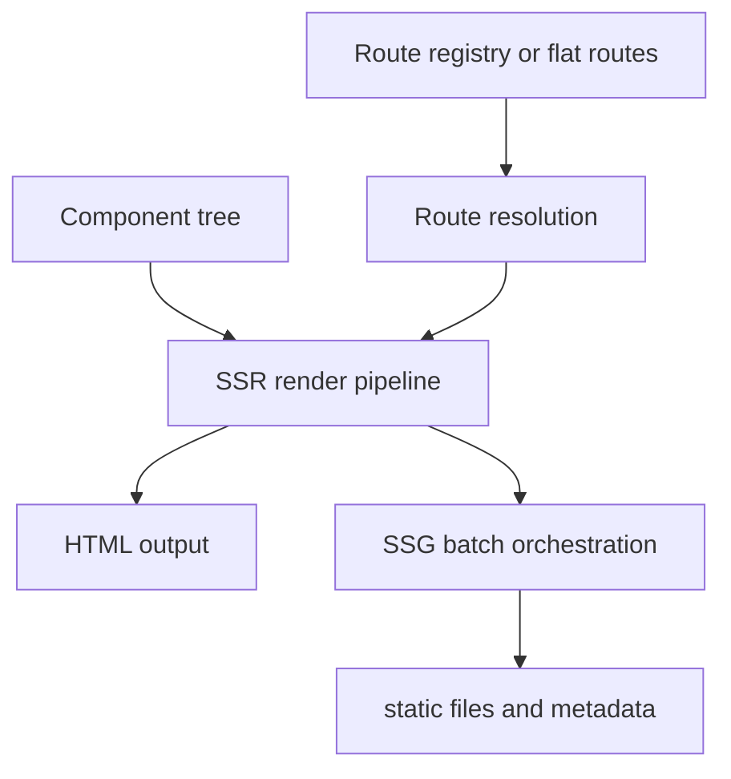
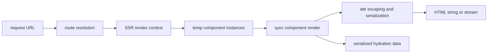
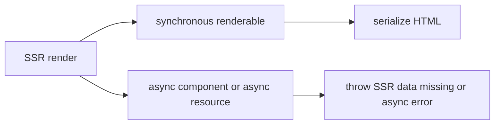

# Internals: SSR and SSG Pipeline

This page documents the server output path in `src/ssr` and `src/ssg`.

## Shared model

SSR and SSG reuse the same route model and the same component semantics. The
main difference is the sink and the orchestration around the render.



## SSR request flow

`renderToString()` and related helpers resolve a route, create request-local
render context, and synchronously serialize HTML.



## SSR execution constraints

The current SSR implementation is synchronous. Async components, async
`resource()` work, and async document renderers are rejected because awaiting
during render would break deterministic hydration output. Request handlers may
perform async work before rendering, but the render phase itself does not await.



## SSG generation flow

SSG wraps SSR with route expansion, batching, file writes, and metadata.
`entries()` may be async because it runs before rendering; each concrete page
still renders through the synchronous SSR engine.


## Route expansion for SSG

Parameterized routes become concrete output paths through `entries()`.

```mermaid
flowchart LR
  routeTemplate[/posts/{slug}]
  entries[entries() -> param maps]
  interpolate[interpolateRoutePath()]
  outputs[/posts/a and /posts/b]

  routeTemplate --> entries
  entries --> interpolate
  interpolate --> outputs
```

## Incremental output model

SSG can compare current renders with the incremental manifest to decide what was
written and to preserve metadata across runs.

```mermaid
flowchart LR
  previous[previous incremental manifest]
  current[current route render result]
  hash[hashHtml()]
  compare[compare hash and output metadata]
  write[write file or skip]
  manifest[next incremental manifest]

  previous --> compare
  current --> hash
  hash --> compare
  compare --> write
  compare --> manifest
```

## Design notes

- `src/ssr/index.ts` is the stable SSR facade. The HTML serialization,
  component execution, hydration verification, and route orchestration
  implementation live behind that synchronous entrypoint.
- `src/ssr/create-ssr.ts` wraps that path into a request-oriented API.
- `src/ssg/create-static-gen.ts` is the top-level SSG orchestrator.
- SSG is not a separate renderer; it is route expansion plus repeated
  synchronous SSR.
- Both modes depend on `src/router/resolution.ts` and the normalized route
  model rather than a second routing implementation.

## Related docs

- [Core engine design](./core-engine-design.md)
- [Router internals](./router-manifest.md)
- [Core: Rendering](../core/rendering.md)
