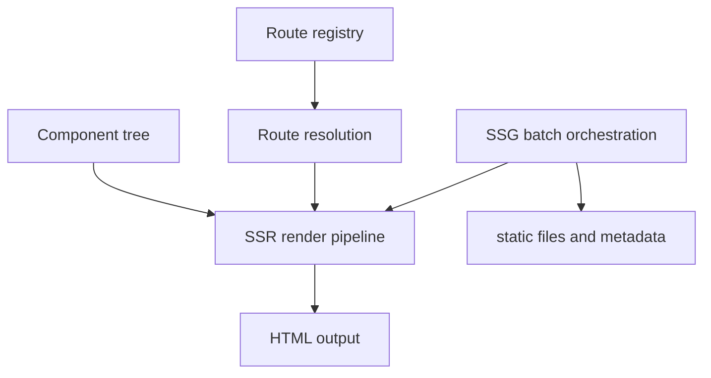
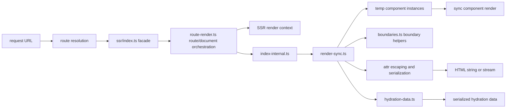
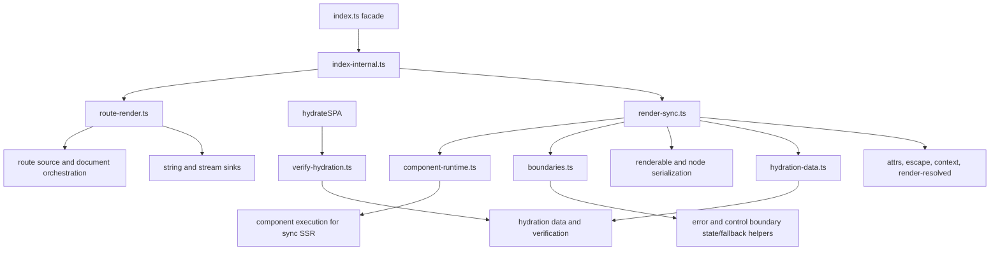
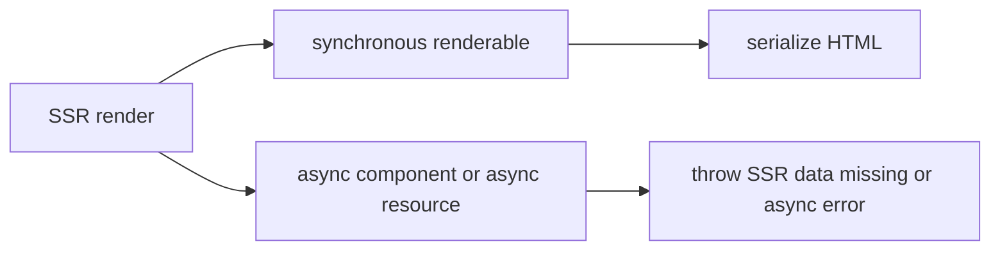
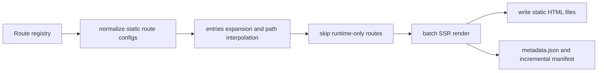

# Internals: SSR and SSG Pipeline

This page documents the server output path in `src/ssr` and `src/ssg`.

## Shared model

SSR and SSG reuse the same route model and the same component semantics. The
main difference is the sink and the orchestration around the render.



## SSR request flow

`renderToString()` and related helpers resolve a route, create request-local
render context, and synchronously serialize HTML.



## SSR Implementation Ownership

`src/ssr/index.ts` preserves the public entrypoint. The active implementation
is split between route/document orchestration in `route-render.ts` and
synchronous serialization in `render-sync.ts`. `index-internal.ts` keeps the
public SSR orchestration and route render host. `component-runtime.ts` owns
synchronous component execution. `hydration-data.ts` owns render-data script
serialization. `boundaries.ts` owns error/control boundary state helpers,
renderable child normalization, and default fallback construction. The client
boot path calls `verify-hydration.ts` when markup verification is enabled; that
helper renders the resolved route to a normalized string and compares it with
the adopted DOM. Helper modules own escaping, attributes, sinks, render
context, and resolved-route rendering.



## SSR execution constraints

The current SSR implementation is synchronous. Async components, async
`resource()` work, and async document renderers are rejected because awaiting
during render would break deterministic hydration output. Request handlers may
perform async work before rendering, but the render phase itself does not await.



## Control range markers and hydration

SSR uses the same anchored range contract as the client renderer. A singleton
control result is serialized as its one node. Multi-node `Show`, `Case`,
fragment, and keyed `For` output is enclosed by deterministic
`askr-range-start` and `askr-range-end` comment markers, including empty
ranges. Hydration consumes markers structurally, validates nesting and
ownership order, and adopts the nodes between each pair; it does not infer a
range from adjacent siblings or insert a wrapper element.

This makes SSR, client rendering, keyed reorder/removal, and failed replacement
use the same range boundaries. A malformed or mismatched marker structure is a
hydration error rather than a permissive single-root fallback.

## SSG generation flow

SSG wraps SSR with route expansion, batching, file writes, and metadata.
`entries()` may be async because it runs before rendering; each concrete page
still renders through the synchronous SSR engine.



## Route expansion for SSG

Parameterized routes become concrete output paths through `entries()`.

```mermaid
flowchart LR
  routeTemplate[/posts/{slug}]
  entries[entries() -> param maps]
  interpolate[interpolateRoutePath()]
  outputs[/posts/a and /posts/b]

  routeTemplate --> entries
  entries --> interpolate
  interpolate --> outputs
```

## Incremental output model

SSG can compare current renders with the incremental manifest to decide what was
written and to preserve metadata across runs.

```mermaid
flowchart LR
  previous[previous incremental manifest]
  current[current route render result]
  hash[hashHtml()]
  compare[compare hash and output metadata]
  write[write file or skip]
  manifest[next incremental manifest]

  previous --> compare
  current --> hash
  hash --> compare
  compare --> write
  compare --> manifest
```

## Design notes

- `src/ssr/index.ts` is the stable SSR facade. `src/ssr/index-internal.ts`
  keeps public SSR orchestration and the route render host.
  `src/ssr/render-sync.ts` owns synchronous HTML serialization and
  component-form `renderToString()`. `src/ssr/hydration-data.ts` owns
  hydration render-data serialization. `src/ssr/verify-hydration.ts` is called
  by `hydrateSPA()` to compare adopted DOM with a normalized synchronous route
  render when verification is enabled. That verification render uses the
  already-resolved handler and params; it does not repeat auth, policy,
  preload, lazy-loader, redirect, or route-loader resolution.
  Comparison excludes framework-owned hydration payload and request-local SSR
  style carrier elements, which are not part of the adopted app subtree.
  `src/ssr/boundaries.ts` owns
  error/control boundary state helpers, renderable child normalization, and
  default fallback construction. `src/ssr/component-runtime.ts` owns
  synchronous component execution, strict-purity guards, temporary owner
  cleanup, and default portal wrapping.
- `src/ssr/route-render.ts` owns object-form `renderToString()`,
  `renderToStream()`, route source normalization, route match resolution,
  `resolveRequest()`, document render argument construction, and string/stream
  sink orchestration.
- `src/ssg/create-static-gen.ts` is the top-level SSG orchestrator for
  generation config, render batching, file writes, metadata, and manifest
  assembly. `static-routes.ts` owns route-source normalization, `entries()`
  expansion, and runtime-only route filtering. `generation-plan.ts` owns
  incremental route selection and stale-route result planning.
- SSG is not a separate renderer; it is route expansion plus repeated
  synchronous SSR.
- Both modes depend on `src/router/resolution.ts` and the normalized route
  model rather than a second routing implementation.

## Architecture Review Notes

The SSR and SSG diagrams are backed by architecture checks:

- `index-internal.ts`, `render-sync.ts`, and `hydration-data.ts` each have
  explicit ownership and line ceilings. The client boot dependency on
  `verify-hydration.ts` is an explicit architecture-check exception.
- `create-static-gen.ts`, `static-routes.ts`, and `generation-plan.ts` have
  explicit ownership and line ceilings.
- SSG should remain an orchestration layer over route expansion and repeated
  synchronous SSR. Any new data-loading work belongs before render, not inside
  the SSR render phase.

## Related docs

- [Core engine design](./core-engine-design.md)
- [Router internals](./router-manifest.md)
- [Core: Rendering](../core/rendering.md)
