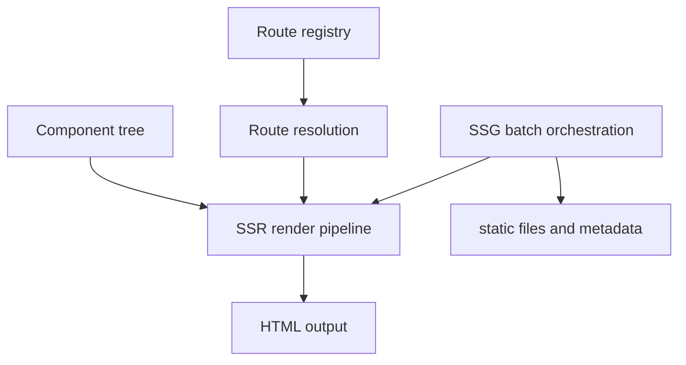
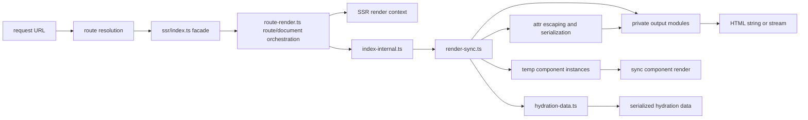
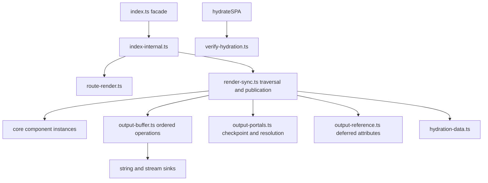
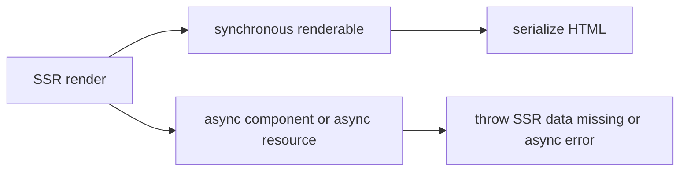
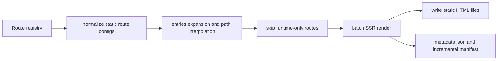

# Internals: SSR and SSG Pipeline

This page documents the server output path in `src/ssr` and `src/ssg`.

## Shared model

SSR and SSG reuse the same route model and the same component semantics. The
main difference is the sink and the orchestration around the render.

```mermaid
flowchart TB
  registry[Route registry]
  components[Component tree]
  routeResolve[Route resolution]
  ssrRender[SSR render pipeline]
  html[HTML output]
  ssgBatch[SSG batch orchestration]
  files[static files and metadata]

  registry --> routeResolve
  components --> ssrRender
  routeResolve --> ssrRender
  ssrRender --> html
  ssgBatch --> ssrRender
  ssgBatch --> files
```

## SSR request flow

`renderToString()` and related helpers resolve a route, create request-local
render context, and synchronously serialize HTML.

```mermaid
flowchart LR
  url[request URL]
  routeResolve[route resolution]
  ssrContext[SSR render context]
  facade[ssr/index.ts facade]
  routeRender[route-render.ts route/document orchestration]
  internal[index-internal.ts]
  renderSync[render-sync.ts]
  hydrationData[hydration-data.ts]
  output[private output modules]
  componentInstance[temp component instances]
  syncRender[sync component render]
  attrs[attr escaping and serialization]
  html[HTML string or stream]
  hydrateData[serialized hydration data]

  url --> routeResolve
  routeResolve --> facade
  facade --> routeRender
  routeRender --> ssrContext
  routeRender --> internal
  internal --> renderSync
  renderSync --> output
  renderSync --> componentInstance
  componentInstance --> syncRender
  renderSync --> attrs
  attrs --> output
  output --> html
  renderSync --> hydrationData
  hydrationData --> hydrateData
```

## SSR Implementation Ownership

Sibling components can supply private reference metadata for accessible IDs
that are discovered later in the same rendered root. The renderer buffers that
root and carries string or omitted-value cells for `aria-labelledby`,
`aria-describedby`, and `aria-controls` through successful boundary buffers.
It expands portal content before serializing those reference cells, while all
ordinary props keep their existing evaluation, ownership, and error handling.
No component or caller attribute function runs again. This internal bridge
does not add public JSX props; roots without the private marker keep their
existing serialization order and bytes.

`src/ssr/index.ts` preserves the public entrypoint. `index-internal.ts`
coordinates the public SSR helpers and route render host. `route-render.ts`
owns route/document orchestration; `render-sync.ts` owns synchronous traversal,
component execution through core component instances, boundary recovery,
namespace and select state, and the point at which successful output is
published.

The private output modules sit below traversal:

- `output-buffer.ts` records ordered text, portal, reference-attribute, and
  attribute-root operations. Failed boundary buffers are discarded. Successful
  buffers publish to the chosen sink; streaming writes the prefix immediately
  and buffers once a portal or deferred attribute root requires finalization.
- `output-portals.ts` checkpoints portal writers for boundary rollback and
  resolves host tokens in writer order. The renderer supplies the callback that
  renders each writer with its owner and host namespace. Newly discovered nested
  hosts are resolved before completion.
- `output-reference.ts` owns request-local reference tokens and serializes their
  final cell values after portal expansion. It does not re-evaluate caller props.

`hydration-data.ts` owns render-data script serialization. The client boot path
calls `verify-hydration.ts` when markup verification is enabled. It compares the
server render with both the adopted DOM and the DOM after hydration commits.
The comparison normalizes through the DOM: comments, transport carriers, and
renderer key/skip bookkeeping are dropped; style declarations are compared by
their parsed values. Escaping, attributes, sinks, context, and resolved-route
rendering remain separate helpers.

```mermaid
flowchart TB
  facade[index.ts facade]
  internal[index-internal.ts]
  routeRender[route-render.ts]
  renderSync[render-sync.ts traversal and publication]
  components[core component instances]
  buffers[output-buffer.ts ordered operations]
  portals[output-portals.ts checkpoint and resolution]
  references[output-reference.ts deferred attributes]
  hydrationData[hydration-data.ts]
  boot[hydrateSPA]
  verification[verify-hydration.ts]
  sinks[string and stream sinks]

  facade --> internal
  internal --> routeRender
  internal --> renderSync
  renderSync --> components
  renderSync --> buffers
  renderSync --> portals
  renderSync --> references
  renderSync --> hydrationData
  buffers --> sinks
  boot --> verification
```

## SSR execution constraints

The current SSR implementation is synchronous. Async components, async
`resource()` work, and async document renderers are rejected because awaiting
during render would break deterministic hydration output. Request handlers may
perform async work before rendering, but the render phase itself does not await.

```mermaid
flowchart LR
  render[SSR render]
  sync[synchronous renderable]
  async[async component or async resource]
  ok[serialize HTML]
  fail[throw SSR data missing or async error]

  render --> sync
  render --> async
  sync --> ok
  async --> fail
```

## Control range markers and hydration

SSR uses the same anchored range contract as the client renderer. A singleton
control result is serialized as its one node. Multi-node `Show`, `Case`,
fragment, and keyed `For` output is enclosed by deterministic
`askr-range-start` and `askr-range-end` comment markers, including empty
ranges. Hydration consumes markers structurally, validates nesting and
ownership order, and adopts the nodes between each pair; it does not infer a
range from adjacent siblings or insert a wrapper element.

This makes SSR, client rendering, keyed reorder/removal, and failed replacement
use the same range boundaries. A malformed or mismatched marker structure is a
hydration error rather than a permissive single-root fallback.

## SSG generation flow

SSG wraps SSR with route expansion, batching, file writes, and metadata.
`entries()` may be async because it runs before rendering; each concrete page
still renders through the synchronous SSR engine.

```mermaid
flowchart LR
  registry[Route registry]
  normalize[normalize static route configs]
  expand[entries expansion and path interpolation]
  filter[skip runtime-only routes]
  render[batch SSR render]
  write[write static HTML files]
  metadata[metadata.json and incremental manifest]

  registry --> normalize
  normalize --> expand
  expand --> filter
  filter --> render
  render --> write
  render --> metadata
```

## Route expansion for SSG

Parameterized routes become concrete output paths through `entries()`.

```mermaid
flowchart LR
  routeTemplate[/posts/{slug}]
  entries[entries() -> param maps]
  interpolate[interpolateRoutePath()]
  outputs[/posts/a and /posts/b]

  routeTemplate --> entries
  entries --> interpolate
  interpolate --> outputs
```

## Incremental output model

SSG can compare current renders with the incremental manifest to decide what was
written and to preserve metadata across runs.

```mermaid
flowchart LR
  previous[previous incremental manifest]
  current[current route render result]
  hash[hashHtml()]
  compare[compare hash and output metadata]
  write[write file or skip]
  manifest[next incremental manifest]

  previous --> compare
  current --> hash
  hash --> compare
  compare --> write
  compare --> manifest
```

## Design notes

- `src/ssr/index.ts` is the stable SSR facade. `src/ssr/index-internal.ts`
  keeps public SSR orchestration and the route render host.
  `src/ssr/render-sync.ts` owns synchronous HTML serialization,
  component-form `renderToString()`, SSR purity guards, error-boundary
  fallback rendering, and default portal wrapping; it runs each component's
  render through the core component instance and serializes the output with
  its own writer. `src/ssr/hydration-data.ts` owns
  hydration render-data serialization. `src/ssr/verify-hydration.ts` is called
  by `hydrateSPA()` to compare adopted DOM with a normalized synchronous route
  render when verification is enabled. That verification render uses the
  already-resolved handler and params; it does not repeat auth, policy,
  preload, lazy-loader, redirect, or route-loader resolution.
  Comparison excludes framework-owned hydration payload and request-local SSR
  style carrier elements, which are not part of the adopted app subtree.
- `src/ssr/route-render.ts` owns object-form `renderToString()`,
  `renderToStream()`, route source normalization, document render argument
  construction, and string/stream sink orchestration.
- Both SSR paths resolve policy and auth through the router's
  `resolveRouteRequest()`. `src/ssr/route-policy-resolution.ts` serves the
  synchronous `renderToString()` and `renderToStream()` paths: it pre-matches
  the route, rejects routes with loaders, then calls `resolveRouteRequest()`
  with `load: false`. `src/ssr/route-request-render.ts` owns `renderRouteRequest()`
  and `renderRouteRequestToString()`, which resolve with loaders and return
  redirect, deny, and no-match results.
- `src/ssg/create-static-gen.ts` is the top-level SSG orchestrator for
  generation config, render batching, file writes, metadata, and manifest
  assembly. `static-routes.ts` owns route-source normalization, `entries()`
  expansion, and runtime-only route filtering. `generation-plan.ts` owns
  incremental route selection and stale-route result planning.
- SSG is not a separate renderer; it is route expansion plus repeated
  synchronous SSR.
- Both modes depend on `src/router/resolution.ts` and the normalized route
  model rather than a second routing implementation.

## Architecture Review Notes

The SSR and SSG diagrams are backed by architecture checks:

- Server modules cannot import browser renderer implementations. The client
  boot dependency on `verify-hydration.ts` is an explicit dependency exception.
- Private SSR output modules cannot import traversal, route orchestration, or
  component execution at runtime. The renderer supplies portal traversal through
  a callback and owns the publication point.
- Request-isolation, nested synchronous execution, hydration authentication,
  streaming cancellation, and generation tests enforce behavior at these seams.
- SSG should remain an orchestration layer over route expansion and repeated
  synchronous SSR. Any new data-loading work belongs before render, not inside
  the SSR render phase.

## Related docs

- [Core rewrite](./core-rewrite.md)
- [Router internals](./router-manifest.md)
- [Core: Rendering](../core/rendering.md)
